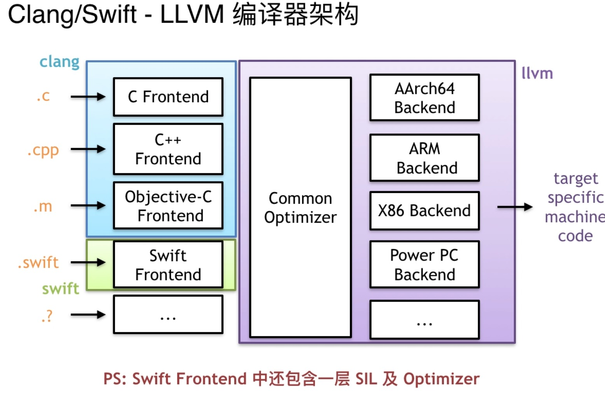
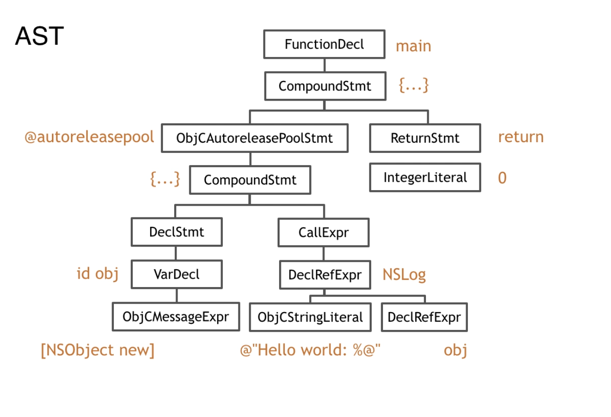
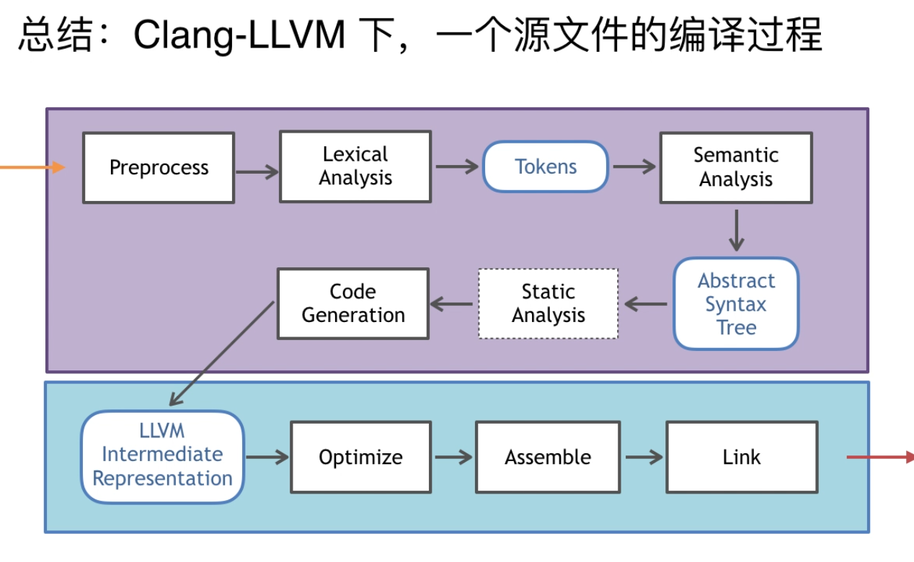

# 1.1 Clang-LLVM


* 编译流程图


* Run main 脚本  Compile main.m
```
/Applications/Xcode.app/Contents/Developer/Toolchains/XcodeDefault.xctoolchain/usr/bin/clang -x objective-c -arch x86_64 -fmessage-length=0 -fdiagnostics-show-note-include-stack -fmacro-backtrace-limit=0 -std=gnu99 -fobjc-arc -fmodules -gmodules -fmodules-cache-path=/Users/wudezhi/Library/Developer/Xcode/DerivedData/ModuleCache.noindex -fmodules-prune-interval=86400 -fmodules-prune-after=345600 -fbuild-session-file=/Users/wudezhi/Library/Developer/Xcode/DerivedData/ModuleCache.noindex/Session.modulevalidation -fmodules-validate-once-per-build-session -Wnon-modular-include-in-framework-module -Werror=non-modular-include-in-framework-module -Wno-trigraphs -fpascal-strings -O0 -fno-common -Wno-missing-field-initializers -Wno-missing-prototypes -Werror=return-type -Wdocumentation -Wunreachable-code -Wno-implicit-atomic-properties -
```

* Clang  在命令中也称为一个黑盒


1. 预处理
  * import 头文件处理 替换
  * macro 宏展开 替换
  * /#if
  ```c++
  ///
  clang -E main.m
  
  /// 
  clang -E -fmodules main.m
  ```

2. 词法分析 拆分
  ```c++
  clang -fmodules -fsyntax -only -Xclang -dump -tokens main.m
  ```
3. 语法分析
  ```c++
  clang -fmodules -fsyntax -only -Xclang -dump -tokens main.m
  ```
  根据当前的语言的语法 生成语乙节点 并将节点组成抽象语法数
  ```c++
  clang -fmodules -fsyntax-only -Xclang -ast-dump main.m
  ```

  ```c
  wudezhideMacBook-Pro-2:ClangTest wudezhi$ clang -fmodules -fsyntax-only -Xclang -ast-dump main.m
  TranslationUnitDecl 0x7fe0960280e8 <<invalid sloc>> <invalid sloc>
  |-TypedefDecl 0x7fe096028660 <<invalid sloc>> <invalid sloc> implicit __int128_t '__int128'
  | `-BuiltinType 0x7fe096028380 '__int128'
  |-TypedefDecl 0x7fe0960286d0 <<invalid sloc>> <invalid sloc> implicit __uint128_t 'unsigned __int128'
  | `-BuiltinType 0x7fe0960283a0 'unsigned __int128'
  |-TypedefDecl 0x7fe096028770 <<invalid sloc>> <invalid sloc> implicit SEL 'SEL *'
  | `-PointerType 0x7fe096028730 'SEL *' imported
  |   `-BuiltinType 0x7fe0960285c0 'SEL'
  |-TypedefDecl 0x7fe096028858 <<invalid sloc>> <invalid sloc> implicit id 'id'
  | `-ObjCObjectPointerType 0x7fe096028800 'id' imported
  |   `-ObjCObjectType 0x7fe0960287d0 'id' imported
  |-TypedefDecl 0x7fe096028938 <<invalid sloc>> <invalid sloc> implicit Class 'Class'
  | `-ObjCObjectPointerType 0x7fe0960288e0 'Class' imported
  |   `-ObjCObjectType 0x7fe0960288b0 'Class' imported
  |-ObjCInterfaceDecl 0x7fe096028990 <<invalid sloc>> <invalid sloc> implicit Protocol
  |-TypedefDecl 0x7fe096028cf8 <<invalid sloc>> <invalid sloc> implicit __NSConstantString 'struct __NSConstantString_tag'
  | `-RecordType 0x7fe096028b00 'struct __NSConstantString_tag'
  |   `-Record 0x7fe096028a60 '__NSConstantString_tag'
  |-TypedefDecl 0x7fe096028d90 <<invalid sloc>> <invalid sloc> implicit __builtin_ms_va_list 'char *'
  | `-PointerType 0x7fe096028d50 'char *'
  |   `-BuiltinType 0x7fe096028180 'char'
  |-TypedefDecl 0x7fe096060c88 <<invalid sloc>> <invalid sloc> implicit __builtin_va_list 'struct __va_list_tag [1]'
  | `-ConstantArrayType 0x7fe096060c30 'struct __va_list_tag [1]' 1 
  |   `-RecordType 0x7fe096060aa0 'struct __va_list_tag'
  |     `-Record 0x7fe096060a00 '__va_list_tag'
  |-ImportDecl 0x7fe0961b5e00 <main.m:9:1> col:1 implicit Foundation
  |-FunctionDecl 0x7fe0961b60a8 <line:11:1, line:20:1> line:11:5 main 'int (int, const char **)'
  | |-ParmVarDecl 0x7fe0961b5e50 <col:10, col:14> col:14 argc 'int'
  | |-ParmVarDecl 0x7fe0961b5f60 <col:20, col:38> col:33 argv 'const char **':'const char **'
  | `-CompoundStmt 0x7fe09685de38 <col:41, line:20:1>
  |   |-ObjCAutoreleasePoolStmt 0x7fe0961cabd8 <line:12:5, line:18:5>
  |   | `-CompoundStmt 0x7fe0961cabb8 <line:12:22, line:18:5>
  |   |   |-DeclStmt 0x7fe0961ca9d0 <line:15:9, col:32>
  |   |   | `-VarDecl 0x7fe0961b62b8 <col:9, col:31> col:12 used obj 'id':'id' cinit
  |   |   |   `-ImplicitCastExpr 0x7fe0961ba8f8 <col:18, col:31> 'id':'id' <BitCast>
  |   |   |     `-ObjCMessageExpr 0x7fe0961ba8c8 <col:18, col:31> 'NSObject *' selector=new class='NSObject'
  |   |   `-CallExpr 0x7fe0961cab50 <line:16:9, col:37> 'void'
  |   |     |-ImplicitCastExpr 0x7fe0961cab38 <col:9> 'void (*)(id, ...)' <FunctionToPointerDecay>
  |   |     | `-DeclRefExpr 0x7fe0961ca9e8 <col:9> 'void (id, ...)' Function 0x7fe0961ba918 'NSLog' 'void (id, ...)'
  |   |     |-ImplicitCastExpr 0x7fe0961cab88 <col:15, col:16> 'id':'id' <BitCast>
  |   |     | `-ObjCStringLiteral 0x7fe0961caa80 <col:15, col:16> 'NSString *'
  |   |     |   `-StringLiteral 0x7fe0961caa48 <col:16> 'char [16]' lvalue "hello word : %@"
  |   |     `-ImplicitCastExpr 0x7fe0961caba0 <col:34> 'id':'id' <LValueToRValue>
  |   |       `-DeclRefExpr 0x7fe0961caaa0 <col:34> 'id':'id' lvalue Var 0x7fe0961b62b8 'obj' 'id':'id'
  |   `-ReturnStmt 0x7fe09685de20 <line:19:5, col:12>
  |     `-IntegerLiteral 0x7fe09685de00 <col:12> 'int' 0
  `-<undeserialized declarations>
  ```
* 语法树


4. 静态分析  checker 通过语法树进行代码静态分析
5. IR代码生成（ llvm）  语法数 从顶至下遍历 翻译为LLVM IR 
	5.1 Objective_C Runtime 桥接
	5.2 将语法树中的ObjcMessageExpr翻译为相应版本的objc_msgSend
	​	super 翻译为 objc_msgSendSuper;
	5.3 更具修饰符 strong weak copy atomic 合成 @proerty 
	​	自动实现的 setter /getter; @synthesize 声明一个实例

6. 优化生成字节码 
7. 生成Target 相关汇编

编译过程 图解

预处理(头文件引入 宏替换) --->词法分析 ---> 语法分析--->语法树--->遍历语法数（静态代码分析）--->IR 代码 ---->字节码 16进制 ---> 汇编---> 可执行文件




### LibClang 

---

payth build 

nodejs build 

clangKit

LibTooling

clangPlugin