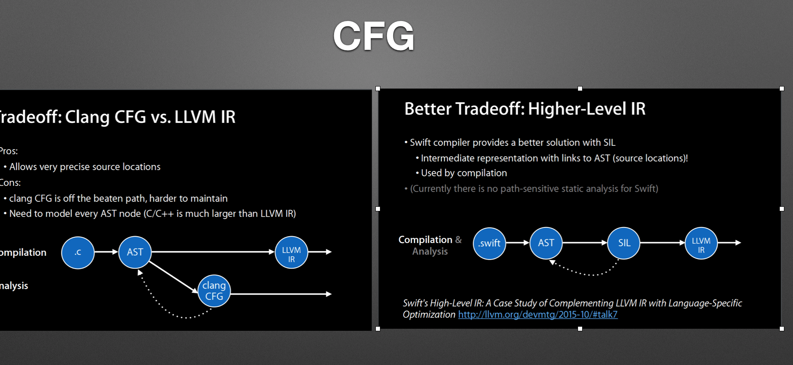
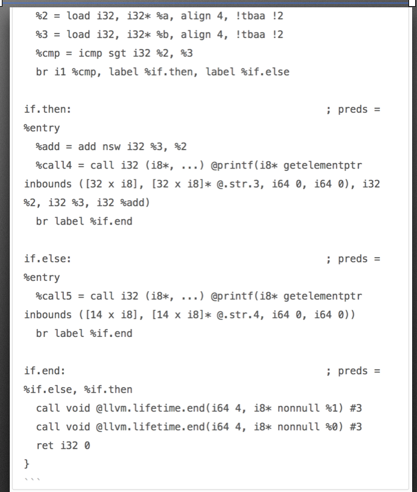

# 1.2 llvm


* 命令：

| clang -E main.m                                           | 预编译处理 宏的替换，头文件的导入                      |
| --------------------------------------------------------- | ------------------------------------------------------ |
| clang -fmodules -fsyntax-only -Xclang -dump-tokens main.m | 词法分析                                               |
| clang -fmodules -fsyntax-only -Xclang -ast-dump main.m    | 语法分析，抽象语法树 AST                               |
| clang -O3 -S -fobjc-arc -emit-llvm main.m -o main.ll      | LLVM IR 中间代码生成 加上 -O3 这样的参数表示 Pass 优化 |
| clang -emit-llvm -c main.m -o main.bc                     | 字节码生成 进一步优化                                  |
| clang -S -fobjc-arc main.m -o main.s                      | 汇编                                                   |
| clang -fmodules -c main.m -o main.o                       | 可执行文件                                             |


* **TraverseDecl()** **进行代码分析**

| 回调方法                                  | 说明                                                         |
| ----------------------------------------- | ------------------------------------------------------------ |
| bool VisitDecl(Decl* D);                  | 访问到任何声明的回调                                         |
| bool VisitFunctionDecl(FunctionDecl *FD); | 访问到函数体时                                               |
| bool VisitBlockDecl(BlockDecl* BD);       | 访问 Block 时的回调 ^(int arg1, float arg2){ statement-body } |


* **CheckerManager- runCheckersOn()

  | runCheckersOnASTDecl();              | -遍历checker列表，找 DeclKind 的 checker，然后运行这些回调函数<br/> |      |
  | ------------------------------------ | ------------------------------------------------------------ | ---- |
  | runCheckersOnASTBody();              | 分析函数体<br/>                                              |      |
  | runCheckersOnEndOfTranslationUnit(); | 编译单元都分析了，再调用回调函数                             |      |
  |                                      |                                                              |      |


*  

  | ConstraintManager.h | 最重要的一个类，用来管理 SymExpr 限制条件                    |
  | ------------------- | ------------------------------------------------------------ |
  | AnalysisManager.h   | 含有核心内容，比如 CheckerManager，DiagnosticsEngine 以及 ASTContext |
  | APSIntType.h        | 静态分析时表示各种不同类型的 Integer                         |
  | BasicValueFactory.h | 引擎的整数池，存放 ASPInt。处理整形边界以及类型。比如 malloc(-1) 分大内存 和 while(char < 300) 死循环这样的问题 |
  | CoreEngine.h        | CFG 上的符号执行，构建出ExplodedGraph                        |
  | ExprEngine.h        | 构建在 CoreEngine 上                                         |
  | SVals.h             | 定义 SVal，Loc 和 NonLoc 等类，分析中获得的值比如变量和内存地址值 |
  | SValBuilder.h       | 符号执行创建                                                 |
  | Environment.h       | 存储能引用的表达式与符号值做对应映射，生命周期只在当前语句，比如 if(foo(a) + 1 > b) {} 这时 foo(a) -> SVal，b -> SVal |
  | ExplodedGraph.h     | CFG 上符号执行的结果                                         |
  | ProgramState.h      | 分析过程中的程序状态，状态包括 Environment 当前环境，store 当前存储的 SVal，GenericDataMap 用户定义的数据 |
  | BlockCounter.h      | 记录一条路径上某个 block 共执行多少次                        |
  | FunctionSymmary.h   | 函数信息的记录，在 inline 时有非常重要的作用                 |
  | CallEvent.h         | 定义了函数调用                                               |
  | Store.h             | 对内存存储进行修改                                           |
  | StoreRef.h          | Store 的包装类                                               |
  | MemRegion.h         | 内存位置进行抽象的类，MemRegion，SubRegion，AllocaRegion，MemSpaceRegion和StackRegion |
  | CheckerContext.h    | 给 checker 提供上下文信息                                    |
  | WorkList.h          | 工作队列算法（worklist algorithm），DFS、BFS以及BFSBlockDFSContents三个类继承于它，表示不同的 CFG 遍历规则 |


* **调试命令**

  | clang -cc1 -analyzer-checker-help                            | 打印可用 checker    |
  | ------------------------------------------------------------ | ------------------- |
  | clang -cc1 -analyze -analyzer-checker=debug.DumpCFG main.c   | CFG 信息            |
  | clang -cc1 -analyze -analyzer-checker=debug.ViewExplodedGraph main.c | Exploded Graph 信息 |
  | clang -Xclang -ast-dump main.c -c                            | AST 信息            |

* **CFG**

  


# LLVM IR 中间代码

---

```c
@ - 代表全局变量
% - 代表局部变量
alloca - 指令在当前执行的函数的堆栈帧中分配内存，当该函数返回到其调用者时，将自动释放内存。
i32：- i 是几这个整数就会占几位，i32就是32位4字节
align - 对齐，比如一个 int,一个 char 和一个 int。单个 int 占4个字节，为了对齐只占一个字节的 char需要向4对齐占用4字节空间。
Load - 读出，store 写入
icmp - 两个整数值比较，返回布尔值
br - 选择分支，根据 cond 来转向 label，不根据条件跳转的话类似 goto
label - 代码标签
```


# LLVM 优化 

---
* 编译时优化 - 编译前端将源代码编译成LLVM IR
* 链接时优化 - 跨文件的分析优化
* 运行时优化 - 收集运行时的信息 profiling information
* 闲时优化 - 获得运行时的 profiling information，然后生成更高效的代码


1. Pass 	
   - LLVM 的优化和转换由多个 Pass 来完成，每个 Pass 完成特定的优化工作。
   - Pass 之间有关联，体现在运行一个 Pass 之前需要先运行另一个 Pass。相应都有实现的接口。
   - 可以对特定功能的 Pass 进行分组，允许一个 Pass 注册到多个分组中。
   - 允许添加自己开发的 Pass 和关闭指定默认的 Pass。
   - 自己开发调试 Pass 非常独立，不会影响整个 LLVM 的结构
2. Pass分类
   - ImmutablePass - 不常用，用于处理那些固定信息，能提供当前编译器信息。
   - ModulePass - 最常用的父类，能够让你的 Pass 将整个程序作为一个单位，可以引用，添加和删除 Function。
   - CallGraphSCCPass - 自上而下遍历程序，分析调用关系图，
   - FunctionPass - 修改 Function 的行为，但是不能修改外部功能，包括添加或删除全局变量等。
   - LoopPass - 以循环嵌套顺序了处理循环，最外层最后处理。
   - RegionPass - 和 LoopPass 类似，不同的是在 Function 里的单个条目退出 region 上执行。
   - BasicBlockPass -  和 FunctionPass 类似，会限制修改范围。
   - MachineFunctionPass - 是 LLVM 代码生成器的一个部分，描述每个程序里的函数执行后在机器上表现。

3. 相关资料地址
   - <http://llvm.org>
   - <http://clang.llvm.org/>
   - <http://www.aosabook.org/en/llvm.html>