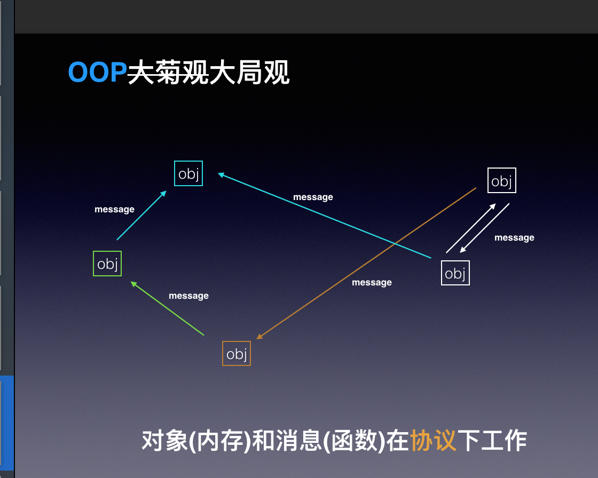
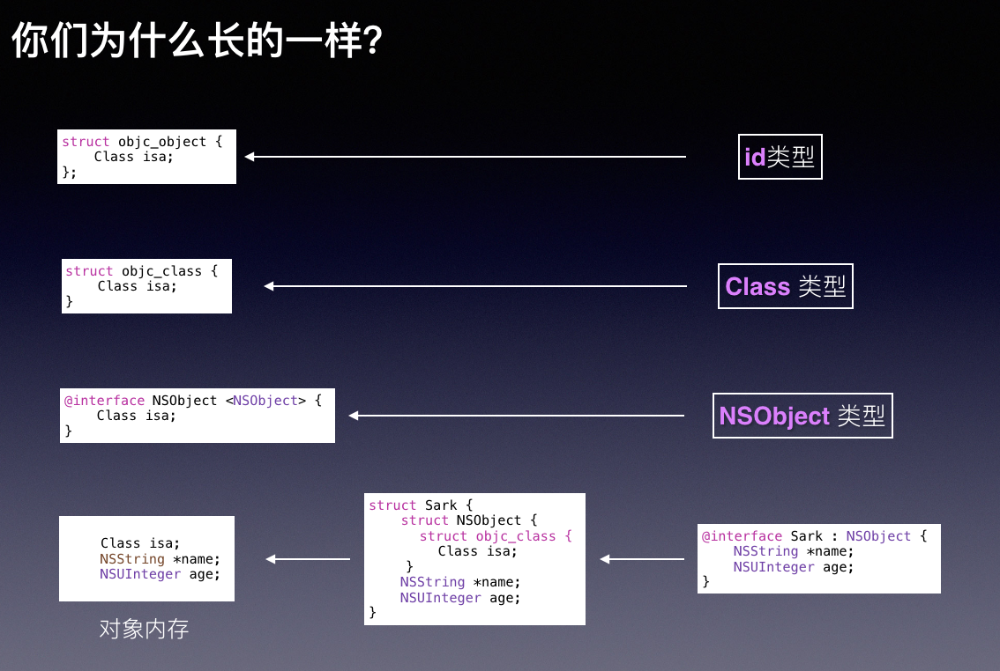
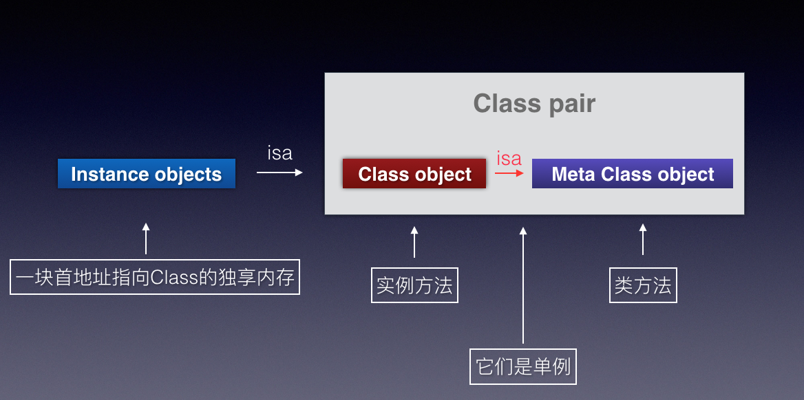
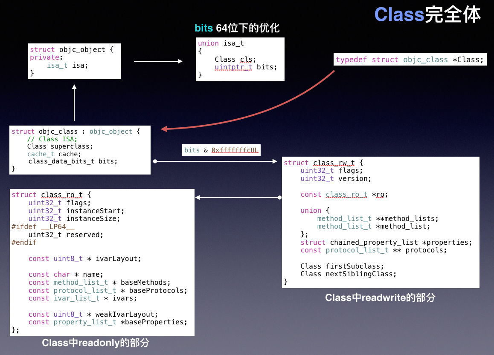
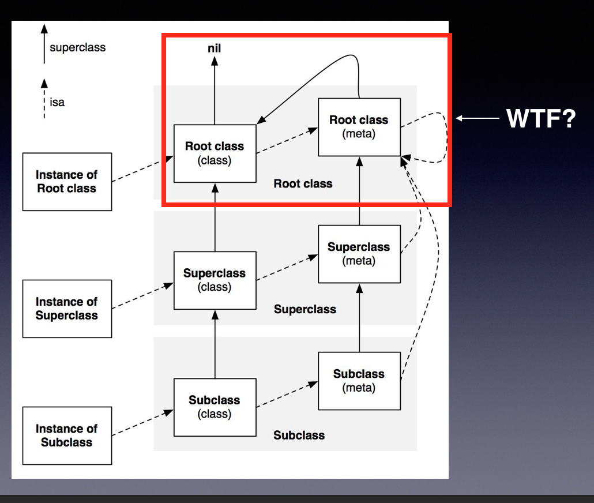
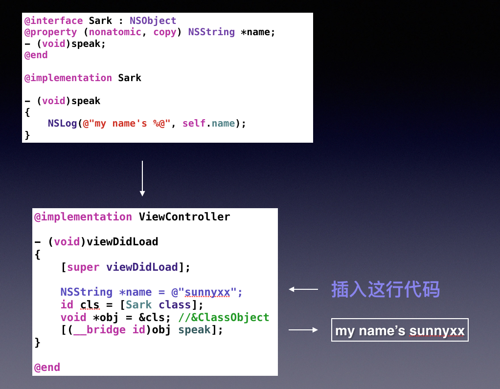

# 3.1 runtime

#### 静态语言和 动态语言
	- c  语言
		void foo(){} -->_foo 符号全局唯一  在编译的时候确定
	- c++
	``` C++
	    namespace Mak(){
	    class Sark {
	        public :
	            void FOO（int a）{
	
	            }
	    }
	} 
	
	//// --编译 ---> ZNMark4Sark3FooEi--->全局唯一标示 --->在编译的时候确定
	```
		
	- objc
	```objc
	 -(void)foo{
	
	 }
	
	 /// --> 编译 --->objc_msgSend(objc,"foo")--运行->（IMP)add(self,_cmd)
	 /// 编译的时候函数地址不确定 在运行的时候根据Selector查找
	```


####1. OOP

####2. runtime  isa
	- 3.1 isa指针是OOP下runtime消息机制的协议 只要首地址是isa指针，就能给你发消息 管你是NSObject *、是Class、还是Sark 

####3. runtime 的函数结构
  

  - id 
  ```objc
  	struct objc_object{
            Class isa;
  	}
  ```

  - Class 
  ```objc
  	struct objc_class {
            Class isa;
  	}
  ```

  - NSObject 
  ```objc
  	@interface NSObject<NSObject>{
            Class isa;
  	}
  ```


* 替换
  ```objc
       @interface Sark : NSObject{
           NSString * name;
           NSString * age;
       }
  ```

   ```c++
         struct Sark{
             struct NSObject {
                 struct objc_class{
                     Class isa;
                 }
             }
             NSString * name;
             NSString * age;
         }
   ```


* 一个对象是如何创建
	instanceSize 编译时决定
	size_t size = cls->instanceSize();
	id objc = (id)calloc(1, size);
	objc.isa = (uintprt_t)cls;

* 构成Objc runtime的三种对象
  
  
   1. instance objects  一块首地址指向Class的独立内存
   2. instance objects - >isa 
   3. Class object ---> 实例方法 /-号方法  + 实例变量  
   4. Meta Class objc --- > 类方法  /+方法 （元类） -->super调用 --->...


#### 4. 当向一个Class发消息时，它是一个实例变量
   未发送消息时，它只是一个Type
   ```objc
   	Sark * sark = [Sark new];
   	NSStringFromClass(Sark); ///error
   	NSStringFromClass([Sark class]);//  success;
   ```

#### 5. runtime 消息机制
  [obj foo]; ---编译--> objc_msgSend(obj, "foo");

  super 的理解 ---> 去 父类 或 父类元类  查找方法 --> 没有得话 ---> 去 父类的父类 和 父类父类的元类  查找方法----> 最后rootClass ---> 本身

  ```c++
  super ----> ojec_msgSendSuper2(struct objc_super * super, SEL op ...)
  
  struct objc_super2 {
        id receiver;
        Class current_class;
  }
  ```

#### 6. objc 中Class的结构体  Class 完全结构体
  
   ### typedef struct objc_class * Class

   - 6.1  
   ```c++
   union isa_t{
       Class cls;
       uintptr_t bits;
   }
   ```

   -  6.2    
  ```c++
   	struct objc_object{
        private :
        	isa_t ias;
   	}
  ```
   -  6.3     
  ```c++
   	struct objc_class: objc_object{
        Class superclass;
        cache_t cache;
        class_data_bits_t bits;
   	}
  ```

   - 6.4
  ```c++
    /// class_data_bits_t bits && 0xfffffffcul 
        struct class_rw_t{
        uint32_t flags;
        uint32_t version;

        const class_or_t * or;
        uinon {
            method_list_t ** method_lists;
            method_list_t ** method_list;
        };

        struct chained_poperty_list * properties;
        const proptocol_list_t ** propcols;
        Class firsrSubClass;
        CLass nextSiblingClass;
        }
  ```

 - 6.5 

```c++
        ///  const class_or_t * or;
        struct  class_or_t {
        uint32_t flags;
        uint32_t instanceStart;
        uint32_t instanceSize;

        const uin8_t * ivarLayout;
        const char * name;
        const method_list_t * baseMethods;
        const protoco_list_t * baseProtocols;
        const ivar_list* ivars;

        const uin8_t * weakIvarLayout;
        const protocol_list_t * baseProtocolties;
        }
```

#### 8.  



#### 9. objc 中的对象到底是什么
-  objc中的对象是一个指向ClassObject地址的变量
-  id obj = &ClassObject 
-  而对象的实例变量
-  void *ivar = &obj + offset(N)
