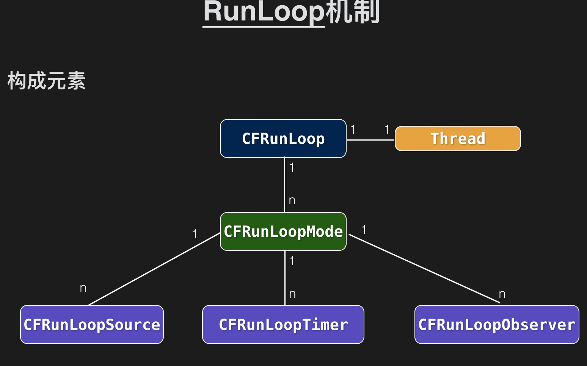

# 2.1 runloop


1. runloop 伪代码  https://opensource.apple.com/tarballs/CF/

使程序一直运行 并接收用户输入 将事件加入消息队列 （Message queue）
决定程序在何时应该处理哪些Event 
调用解偶 (从 Message queue) 取出事件 处理

```object
int main(int argc, char * argv[]) {
   while (AppIsRunning) {
   		///1 终端等待事件唤醒
        id whoWakesMe = SleepForWakingUp();
        ///2 唤醒 获取事件
        id event = GetEvent(whoWakesMe);
        
        ///3 处理事件
        HandleEvent(event);
    }
    return 0;
}
```


2.  RunLoop is Cocoa --> Fundation--> NSRunLoop-->  CoreFundation--> CFunLoop 
  - GCD  
  - mach kernel 
  - block 
  - pthread 
  - 

3. 如何启动的
  * dydl -->start
  * main -- > main.m
  * UIApplicationMain
  * GSEeventLoopRunSepcific ---> Graphics Services
  * CFRunLoopRunSpecific  
  * __CFRunLoopRun
  * _CFRunLoopDoSources0


4. RunLoop 构建



5. RunLoopMode 
  - CFRunLoopSource 
      	 - Source0  处理App内部事件、App自己负责管理（触发），如UIEvent、CFSocket
      	 - Source1  由RunLoop和内核管理，Mach port驱动，如CFMachPort、CFMessagePort


  - CFRunLoopTimer

    ```object
     + (NSTimer *)timerWithTimeInterval:(NSTimeInterval)ti invocation:(NSInvocation *)invocation repeats:(BOOL)yesOrNo;
    
    + (NSTimer *)scheduledTimerWithTimeInterval:(NSTimeInterval)ti invocation:(NSInvocation *)invocation repeats:(BOOL)yesOrNo;
    
    - (void)performSelector:(SEL)aSelector withObject:(id)anArgument afterDelay:(NSTimeInterval)delay inModes:(NSArray *)modes;
    
    + (CADisplayLink *)displayLinkWithTarget:(id)target selector:(SEL)sel;
    - (void)addToRunLoop:(NSRunLoop *)runloop forMode:(NSString *)mode;
    
    
    ```

  - CFRunLoopObserver

    ```objective-c
    typedef CF_OPTIONS(CFOptionFlags, CFRunLoopActivity) {
        kCFRunLoopEntry = (1UL << 0),
        kCFRunLoopBeforeTimers = (1UL << 1),
        kCFRunLoopBeforeSources = (1UL << 2),
        kCFRunLoopBeforeWaiting = (1UL << 5),
        kCFRunLoopAfterWaiting = (1UL << 6),
        kCFRunLoopExit = (1UL << 7),
        kCFRunLoopAllActivities = 0x0FFFFFFFU
    };
    
    /// 向外部报告RunLoop当前状态的更改
    /// 框架中很多机制都由RunLoopObserver触发，如CAAnimation
    ```


    UIKit通过RunLoopObserver在RunLoop两次Sleep间
    对AutoreleasePool进行Pop和Push
    将这次Loop中产生的Autorelease对象释放


​    
​    * CFRunLoopMode
​    	 - NSDefaultRunLoopMode 默认状态、空闲状态
​    	 - UITrackingRunLoopMode 滑动ScrollView时
​    	 - UIInitializationRunLoopMode 私有，App启动时
​    	 - NSRunLoopCommonModes Mode集合


* 下面的方法Timer被添加到NSDefaultRunLoopMode
	 ```obj
	 [NSTimer scheduledTimerWithTimeInterval:1.0
                                     target:self
                                   selector:@selector(timerTick:)
                                   userInfo:nil
                                    repeats:YES];
	```

	若不希望Timer被ScrollView影响，需添加到NSRunLoopCommonModes
	```obj
	NSTimer *timer = [NSTimer timerWithTimeInterval:1.0
                                             target:self
                                           selector:@selector(timerTick:)
                                           userInfo:nil
                                            repeats:YES];
[[NSRunLoop currentRunLoop] addTimer:timer forMode:NSRunLoopCommonModes];
	```


6. RunLoop的挂起与唤醒
   - 指定用于唤醒的mach_port端口

    - 调用mach_msg监听唤醒端口，被唤醒前，系统内核将这个线程挂起，停留在mach_msg_trap状态

    - 由另一个线程（或另一个进程中的某个线程）向内核发送这个端口的msg后，trap状态被唤醒，RunLoop继续开始干活

7. AFNetworking中RunLoop的创建

   ```objective-c
   + (void)networkRequestThreadEntryPoint:(id)__unused object {
       @autoreleasepool {
           [[NSThread currentThread] setName:@"AFNetworking"];
           
           NSRunLoop *runLoop = [NSRunLoop currentRunLoop];
           [runLoop addPort:[NSMachPort port] forMode:NSDefaultRunLoopMode];
           [runLoop run];
       }
   }
   
   + (NSThread *)networkRequestThread {
       static NSThread *_networkRequestThread = nil;
       static dispatch_once_t oncePredicate;
       dispatch_once(&oncePredicate, ^{
           _networkRequestThread =
           [[NSThread alloc] initWithTarget:self
                                   selector:@selector(networkRequestThreadEntryPoint:)
                                     object:nil];
           [_networkRequestThread start];
       });
       
       return _networkRequestThread;
   }
   ```

8. 一个TableView延迟加载图片的新思路

   ```objective-c
   UIImage *downloadedImage = ...;
       [self.avatarImageView performSelector:@selector(setImage:)
                                  withObject:downloadedImage
                                  afterDelay:0
                                     inModes:@[NSDefaultRunLoopMode]];
   ```

9. 让Crash的App回光返照

     ```objective-c
      CFRunLoopRef runLoop = CFRunLoopGetCurrent();
         NSArray *allModes = CFBridgingRelease(CFRunLoopCopyAllModes(runLoop));
         while (1) {
             for (NSString *mode in allModes) {
                 CFRunLoopRunInMode((CFStringRef)mode, 0.001, false);
             }
         }
     
     /// 接到Crash的Signal后手动重启RunLoop
     ```


# 2 


## 1.`Runloop` 和线程的关系？

1. 一个线程对应一个 `Runloop`。
2. 主线程的默认就有了 `Runloop`。

1. 子线程的 `Runloop` 以懒加载的形式创建。

1. `Runloop` 存储在一个全局的可变字典里，线程是 `key` ，`Runloop` 是 `value`。


## 2.讲一下 `Runloop` 的 `Mode`?(越详细越好)

- 一共有5个 `Mode`，常用的有仨，其中一个是占位用的。
- `Mode` 里面有一个或者多个 `Source`、`timer`、 `Observer`。
  - `Source`事件源，分 0 和 1；本质就是函数回调
  - `timer` 就是计时器
  - `Observer` 顾名思义观察者
- 'Mode' 的切换


## 3.讲一下 `Observer` ？

```objc
typedef CF_OPTIONS(CFOptionFlags, CFRunLoopActivity) {
    kCFRunLoopEntry         = (1UL << 0), // 即将进入Loop
    kCFRunLoopBeforeTimers  = (1UL << 1), // 即将处理 Timer
    kCFRunLoopBeforeSources = (1UL << 2), // 即将处理 Source
    kCFRunLoopBeforeWaiting = (1UL << 5), // 即将进入休眠
    kCFRunLoopAfterWaiting  = (1UL << 6), // 刚从休眠中唤醒
    kCFRunLoopExit          = (1UL << 7), // 即将退出Loop
};
```


## 4. `autoreleasePool` 在何时被释放？

`App`启动后，苹果在主线程 `RunLoop` 里注册了两个 `Observer`，其回调都是 `_wrapRunLoopWithAutoreleasePoolHandler()`。

第一个 `Observer` 监视的事件是 `Entry(即将进入Loop)`，其回调内会调用 `_objc_autoreleasePoolPush()` 创建自动释放池。其 `order` 是 `-2147483647`，优先级最高，保证创建释放池发生在其他所有回调之前。

第二个 `Observer` 监视了两个事件： `BeforeWaiting`(准备进入休眠) 时调用`_objc_autoreleasePoolPop()` 和 `_objc_autoreleasePoolPush()` 释放旧的池并创建新池；`Exit`(即将退出Loop) 时调用 `_objc_autoreleasePoolPop()` 来释放自动释放池。这个 `Observer` 的 `order` 是 `2147483647`，优先级最低，保证其释放池子发生在其他所有回调之后。

在主线程执行的代码，通常是写在诸如事件回调、`Timer`回调内的。这些回调会被 `RunLoop` 创建好的 `AutoreleasePool` 环绕着，所以不会出现内存泄漏，开发者也不必显示创建 `Pool` 了。


## 5.解释一下 `事件响应` 的过程？

苹果注册了一个 `Source1` (基于 `mach port` 的) 用来接收系统事件，其回调函数为 `__IOHIDEventSystemClientQueueCallback()`。

当一个硬件事件(触摸/锁屏/摇晃等)发生后，首先由 `IOKit.framework` 生成一个 `IOHIDEvent` 事件并由 `SpringBoard` 接收。这个过程的详细情况可以参考这里。`SpringBoard` 只接收按键(锁屏/静音等)，触摸，加速，接近传感器等几种 `Event`，随后用 `mach port` 转发给需要的 `App` 进程。随后苹果注册的那个 `Source1` 就会触发回调，并调用 `_UIApplicationHandleEventQueue()` 进行应用内部的分发。

`_UIApplicationHandleEventQueue()` 会把 `IOHIDEvent` 处理并包装成 `UIEvent` 进行处理或分发，其中包括识别 `UIGesture`/处理屏幕旋转/发送给 `UIWindow` 等。通常事件比如 `UIButton 点击`、`touchesBegin/Move/End/Cancel` 事件都是在这个回调中完成的。


## 6.解释一下 `手势识别` 的过程？

当上面的 `_UIApplicationHandleEventQueue()`识别了一个手势时，其首先会调用 `Cancel` 将当前的 `touchesBegin/Move/End` 系列回调打断。随后系统将对应的 `UIGestureRecognizer` 标记为待处理。

苹果注册了一个 `Observer` 监测 `BeforeWaiting` (Loop即将进入休眠) 事件，这个 `Observer` 的回调函数是 `_UIGestureRecognizerUpdateObserver()`，其内部会获取所有刚被标记为待处理的 `GestureRecognizer`，并执行`GestureRecognizer` 的回调。

当有 `UIGestureRecognizer` 的变化(创建/销毁/状态改变)时，这个回调都会进行相应处理。


## 7.解释一下 `NSTimer`。

`NSTimer` 其实就是 `CFRunLoopTimerRef`，他们之间是 `toll-free bridged` 的。一个 `NSTimer` 注册到 `RunLoop` 后，`RunLoop` 会为其重复的时间点注册好事件。例如 `10:00`, `10:10`, `10:20` 这几个时间点。`RunLoop` 为了节省资源，并不会在非常准确的时间点回调这个`Timer`。`Timer` 有个属性叫做 `Tolerance` (宽容度)，标示了当时间点到后，容许有多少最大误差。

如果某个时间点被错过了，例如执行了一个很长的任务，则那个时间点的回调也会跳过去，不会延后执行。就比如等公交，如果 10:10 时我忙着玩手机错过了那个点的公交，那我只能等 10:20 这一趟了。

`CADisplayLink` 是一个和屏幕刷新率一致的定时器（但实际实现原理更复杂，和 NSTimer 并不一样，其内部实际是操作了一个 `Source`）。如果在两次屏幕刷新之间执行了一个长任务，那其中就会有一帧被跳过去（和 `NSTimer` 相似），造成界面卡顿的感觉。在快速滑动 `TableView` 时，即使一帧的卡顿也会让用户有所察觉。`Facebook` 开源的 `AsyncDisplayLink` 就是为了解决界面卡顿的问题，其内部也用到了 `RunLoop`。


## 8.`AFNetworking` 中如何运用 `Runloop`?

`AFURLConnectionOperation` 这个类是基于 `NSURLConnection` 构建的，其希望能在后台线程接收 `Delegate` 回调。为此 `AFNetworking` 单独创建了一个线程，并在这个线程中启动了一个 `RunLoop`：

```objc
+ (void)networkRequestThreadEntryPoint:(id)__unused object {
    @autoreleasepool {
        [[NSThread currentThread] setName:@"AFNetworking"];
        NSRunLoop *runLoop = [NSRunLoop currentRunLoop];
        [runLoop addPort:[NSMachPort port] forMode:NSDefaultRunLoopMode];
        [runLoop run];
    }
}

+ (NSThread *)networkRequestThread {
    static NSThread *_networkRequestThread = nil;
    static dispatch_once_t oncePredicate;
    dispatch_once(&oncePredicate, ^{
        _networkRequestThread = [[NSThread alloc] initWithTarget:self selector:@selector(networkRequestThreadEntryPoint:) object:nil];
        [_networkRequestThread start];
    });
    return _networkRequestThread;
}
```

`RunLoop` 启动前内部必须要有至少一个 `Timer`/`Observer`/`Source`，所以 `AFNetworking` 在 `[runLoop run]` 之前先创建了一个新的 `NSMachPort` 添加进去了。通常情况下，调用者需要持有这个 `NSMachPort (mach_port)` 并在外部线程通过这个 `port` 发送消息到 `loop` 内；但此处添加 `port`只是为了让 `RunLoop` 不至于退出，并没有用于实际的发送消息。

```objc
- (void)start {
    [self.lock lock];
    if ([self isCancelled]) {
        [self performSelector:@selector(cancelConnection) onThread:[[self class] networkRequestThread] withObject:nil waitUntilDone:NO modes:[self.runLoopModes allObjects]];
    } else if ([self isReady]) {
        self.state = AFOperationExecutingState;
        [self performSelector:@selector(operationDidStart) onThread:[[self class] networkRequestThread] withObject:nil waitUntilDone:NO modes:[self.runLoopModes allObjects]];
    }
    [self.lock unlock];
}
```

当需要这个后台线程执行任务时，`AFNetworking` 通过调用 `[NSObject performSelector:onThread:..]` 将这个任务扔到了后台线程的 `RunLoop` 中。


## 9.`PerformSelector` 的实现原理？

当调用 NSObject 的 performSelecter:afterDelay: 后，实际上其内部会创建一个 Timer 并添加到当前线程的 RunLoop 中。所以如果当前线程没有 RunLoop，则这个方法会失效。

当调用 performSelector:onThread: 时，实际上其会创建一个 Timer 加到对应的线程去，同样的，如果对应线程没有 RunLoop 该方法也会失效。


## 10.利用 `runloop` 解释一下页面的渲染的过程？

当我们调用 `[UIView setNeedsDisplay]` 时，这时会调用当前 `View.layer` 的 `[view.layer setNeedsDisplay]`方法。

这等于给当前的 `layer` 打上了一个脏标记，而此时并没有直接进行绘制工作。而是会到当前的 `Runloop` 即将休眠，也就是 `beforeWaiting` 时才会进行绘制工作。

紧接着会调用 `[CALayer display]`，进入到真正绘制的工作。`CALayer` 层会判断自己的 `delegate`有没有实现异步绘制的代理方法 `displayer:`，这个代理方法是异步绘制的入口，如果没有实现这个方法，那么会继续进行系统绘制的流程，然后绘制结束。

过程可以用下面这张图来解释：


`CALayer` 内部会创建一个 `Backing Store`，用来获取图形上下文。接下来会判断这个 `layer` 是否有 delegate。

如果有的话，会调用 `[layer.delegate drawLayer:inContext:]`，并且会返回给我们 `[UIView DrawRect:]` 的回调，让我们在系统绘制的基础之上再做一些事情。

如果没有 `delegate`，那么会调用 `[CALayer drawInContext:]`。

以上两个分支，最终 `CALayer` 都会将位图提交到 `Backing Store`，最后提交给 `GPU`。

至此绘制的过程结束。


## 11.如何使用 `Runloop` 实现一个常驻线程？这种线程一般有什么作用？

一般做法是向 `Runloop` 中放一个 `port`。

创建一条常驻的后台线程，做任何你想做的事。


## 12.为什么 `NSTimer` 有时候不好使？

因为创建的  `NSTimer` 默认是被加入到了 `defaultMode`，所以当 `Runloop` 的 `Mode` 变化时，当前的 `NSTimer` 就不会工作了


## 13.`PerformSelector:afterDelay:`这个方法在子线程中是否起作用？为什么？怎么解决？

不起作用，子线程默认没有 `Runloop`，也就没有 `Timer`。

解决的办法是可以使用 `GCD` 来实现：`Dispatch_after`


## 14.什么是异步绘制？

> 异步绘制，就是可以在子线程把需要绘制的图形，提前在子线程处理好。将准备好的图像数据直接返给主线程使用，这样可以降低主线程的压力。

###### 异步绘制的过程

要通过系统的 `[view.delegate displayLayer:]` 这个入口来实现异步绘制。

- 代理负责生成对应的 Bitmap
- 设置该 Bitmap 为 layer.contents 属性的值。

整个过程可以通过一张图来说明


## 15.如何检测 `App` 运行过程中是否卡顿？