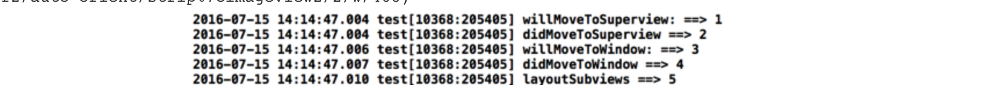
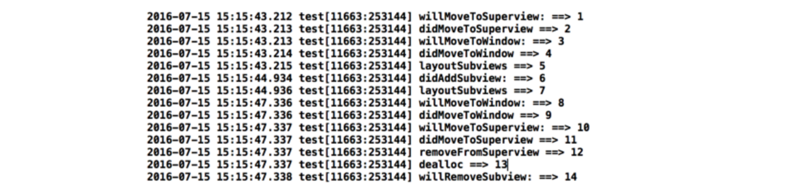

> 探寻UIView的生命周期。我们知道`view`的创建有`init(或new)`的方法，销毁时会自动执行`dealloc`方法，但是UIView的生命周期到底是怎样的呢？我们一步一步来。

首先新建一个项目并创建一个`TestView`继承自`UIView`：


创建TestView

再创建

```
TestViewController
```

继承自UIViewController，用于承载

```
TestView
```

(方便后面测试view销毁时间)：

创建TestViewController


在`Main.storyboard`中给默认的控制器`ViewController`添加导航：


给ViewController添加导航

在

```
ViewController.m
```

中添加如下代码用于跳转操作：


```
- (void)viewDidLoad {
    [super viewDidLoad];
    
    UIButton *btn = [UIButton buttonWithType:UIButtonTypeCustom];
    btn.frame = CGRectMake(100, 100, 100, 100);
    btn.backgroundColor = [UIColor colorWithRed:0.489 green:0.548 blue:0.898 alpha:1.000];
    [btn setTitle:@"push" forState:UIControlStateNormal];
    [btn setTitleColor:[UIColor blackColor] forState:UIControlStateNormal];
    [btn addTarget:self action:@selector(pushTestViewVC:) forControlEvents:UIControlEventTouchUpInside];
    
    [self.view addSubview:btn];
}

- (void)pushTestViewVC:(UIButton *)sender{
    TestViewController *vc = [[TestViewController alloc] init];
    [self.navigationController pushViewController:vc animated:YES];
    
}
```

在`TestViewController.m`中添加如下代码:

```
- (void)viewDidLoad{
    [super viewDidLoad];
    self.view.backgroundColor = [UIColor lightGrayColor];
    
    TestView *view = [[TestView alloc] init];
    view.frame = CGRectMake(8, 100, self.view.bounds.size.width - 8*2, 250);
    view.backgroundColor = [UIColor colorWithRed:0.101 green:0.502 blue:0.427 alpha:1.000];
    [self.view addSubview:view];
    
}
```

> ok,到这儿准备工作完成。运行一下：
>
> 效果图

查看UIViewapi，常用的加载时机大概如下：
- (void)layoutSubviews
- (void)didAddSubview:(UIView *)subview;
- (void)willRemoveSubview:(UIView *)subview;
- (void)willMoveToSuperview:(nullable UIView *)newSuperview;
- (void)didMoveToSuperview;
- (void)willMoveToWindow:(nullable UIWindow *)newWindow;
- (void)didMoveToWindow;
- (void)removeFromSuperview
- (void)dealloc
一一在TestView.m中实现:

```
#import "TestView.h"

@interface TestView (){
    NSInteger count;
}

@end

@implementation TestView

- (instancetype)init{
    self = [super init];
    if (self) {
        
        count = 0;
        
    }
    return self;
}

- (void)layoutSubviews{
    [super layoutSubviews];
    count++;
    NSLog(@"%@ ==> %ld",NSStringFromSelector(_cmd),count);
}

- (void)didAddSubview:(UIView *)subview{
    [super didAddSubview:subview];
    count++;
    NSLog(@"%@ ==> %ld",NSStringFromSelector(_cmd),count);
}

- (void)willRemoveSubview:(UIView *)subview{
    [super willRemoveSubview:subview];
    count++;
    NSLog(@"%@ ==> %ld",NSStringFromSelector(_cmd),count);
}

- (void)willMoveToSuperview:(nullable UIView *)newSuperview{
    [super willMoveToSuperview:newSuperview];
    count++;
    NSLog(@"%@ ==> %ld",NSStringFromSelector(_cmd),count);
}

- (void)didMoveToSuperview{
    [super didMoveToSuperview];
    count++;
    NSLog(@"%@ ==> %ld",NSStringFromSelector(_cmd),count);
}

- (void)willMoveToWindow:(nullable UIWindow *)newWindow{
    [super willMoveToWindow:newWindow];
    count++;
    NSLog(@"%@ ==> %ld",NSStringFromSelector(_cmd),count);
}

- (void)didMoveToWindow{
    [super didMoveToWindow];
    count++;
    NSLog(@"%@ ==> %ld",NSStringFromSelector(_cmd),count);
}

- (void)removeFromSuperview{
    [super removeFromSuperview];
    count++;
    NSLog(@"%@ ==> %ld",NSStringFromSelector(_cmd),count);
}

- (void)dealloc{
    count++;
    NSLog(@"%@ ==> %ld",NSStringFromSelector(_cmd),count);
}

@end
```

`*_cmd表示当前方法的SEL，既执行该方法时打印方法名*`

> 运行，点`push`，控制台打印如下：




push时打印

> 然后点击navigation的`back`按钮：


pop时打印

> 我们发现
> `- (void)didAddSubview:(UIView *)subview;`
> `- (void)willRemoveSubview:(UIView *)subview;`
> 这两个是需要有子视图才能执行，暂时不做讨论。
> 可以看出上面方法中只会执行一次的方法有`removeFromSuperview`、`dealloc`两个方法(`layoutSubviews`在子视图布局变动时会多次调用)，所以可以在这两个方法中执行释放内存等操作(e.g:移除观察者，定时器等)。

------

> OK，下面我们讨论关于`subView`的几个方法，首先在`TestViewController.m`中实现点击按钮给`testView`添加子视图的功能：

```
#import "TestViewController.h"
#import "TestView.h"

@interface TestViewController (){
    
    TestView *testView;
}

@end

@implementation TestViewController
- (void)viewDidLoad{
    [super viewDidLoad];
    self.view.backgroundColor = [UIColor lightGrayColor];
    
    UIBarButtonItem *item = [[UIBarButtonItem alloc] initWithTitle:@"addSubView" style:UIBarButtonItemStylePlain target:self action:@selector(addTestViewSubView)];
    self.navigationItem.rightBarButtonItem = item;
    
    TestView *view = [[TestView alloc] init];
    view.frame = CGRectMake(8, 100, self.view.bounds.size.width - 8*2, 250);
    view.backgroundColor = [UIColor colorWithRed:0.101 green:0.502 blue:0.427 alpha:1.000];
    [self.view addSubview:view];
    testView = view;
    
}
- (void)addTestViewSubView{   
    UIView *view = [[UIView alloc] initWithFrame:CGRectMake(50, 50, 100, 100)];
    view.backgroundColor = [UIColor lightGrayColor];
    view.tag = 100;
    [testView addSubview:view];
    
}
@end
```

> 点击`push`后点击按钮添加子视图：
>
>
>
> 
>
> 添加子视图
>
> 可见
>
> ```
> didAddSubview
> ```
>
> 和
>
> ```
> layoutSubviews
> ```
>
> 都调用了，那我们
>
> ```
> pop
> ```
>
> 回去：
>
>
>
> 
>
> Paste_Image.png
>
> ```
> willRemoveSubview
> ```
>
> 是在
>
> ```
> dealloc
> ```
>
> 后面执行的，通过断点我们发现确实是最后执行的。而且如果有多个子视图，
>
> ```
> willRemoveSubview
> ```
>
> 会循环执行，直到移除所有子视图。
>
>

------

> 以上执行顺序比较清楚，主要是了解UIView的各个时机便于我们进行相关操作。
> 关于：
> - (void)willMoveToSuperview:(nullable UIView *)newSuperview;
> - (void)willMoveToWindow:(nullable UIWindow *)newWindow;
> 这俩个方法可以根据参数是否为nil判断是创建操作还是销毁操作，nil则为销毁，反之，则为创建；
> - (void)didMoveToSuperview;
> 这个方法可以根据self.superview的值判定，nil则为销毁，反之，则为创建。
> - (void)didMoveToWindow;
> 这个方法可以根据self.superview的值判定，nil则为创建，反之，则为销毁。(注意这个方法和上面的是相反的)

作者：魔鬼分界线

链接：https://www.jianshu.com/p/9d98fad685c8

来源：简书

简书著作权归作者所有，任何形式的转载都请联系作者获得授权并注明出处。