# Xcode之断点调试详解

### 第一部分

## 1.设置断点

设置断点，就不说了，大家都知道，在你想要调试的代码处点击设置就行了。通过快捷键"Command＋"也可以。

## 2.断点的自定义设置

(1)在你设置断点的地方，右击该断点，会弹出一个栏，选择Edit Breakpoint，可以对断点进行自定义设置，如下图2-1所示。


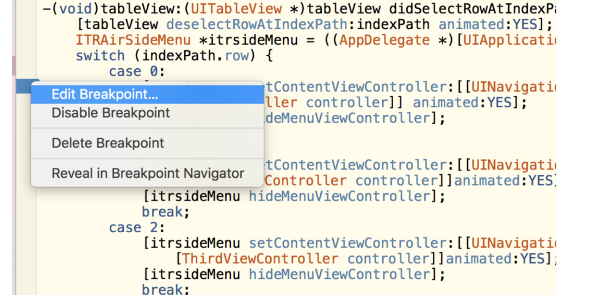

2-1

(2)点击Edit Breakpoint选项后，弹出如下设置框2-2


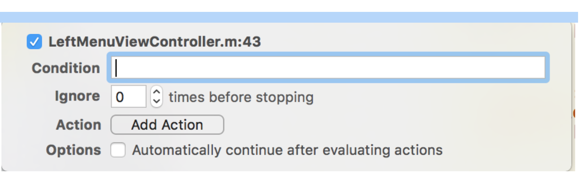

2-2

蓝色对勾后面的，表示当前断点所处的位置，其实我忘了把代码行数弄出来，但它还是显示了当前断点在第43行。至于代码行数显示你可以在菜单栏Xcode->Preferences->Test Editing->勾选Line Numbers，将代码行数字显示出来。将对勾抹去，表示该断点失效。

**Condition**:指的是条件表达式，该项允许我们对断点生效设置条件，表示当满足某一特定条件的前提下，该断点才生效。（该条件的录入，不能够识别预处理的宏定义，也不能识别断点作用域之外的变量和方法）。

**Ignore**：忽略次数。它指定了在断点生效，应用暂停之前，代码忽略断点的次数。你如果希望应用运行一段时间后断点才生效，那么就可以使用这个选项。比如说在调试某一循环体的时候。

**Action**:动作。它表示当断点生效时，Xcode作出反应后的行为动作。点击右边的Add Action选项会弹出如图2-3菜单。


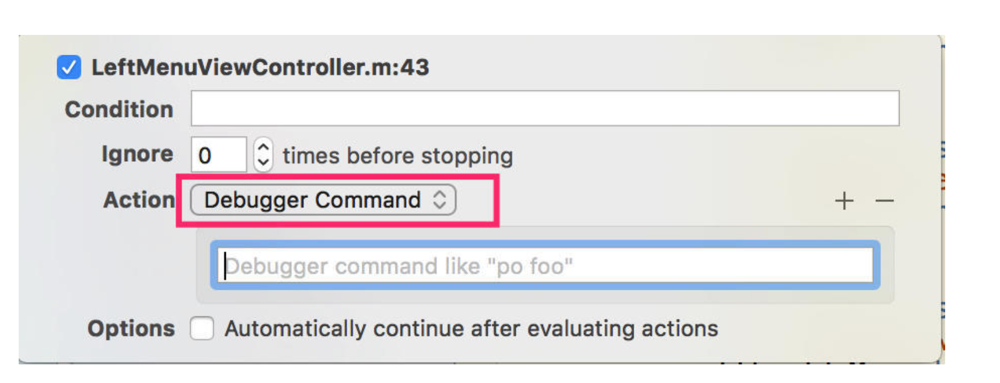

2-3

图中所示红色方框中的选项，可以让你指定那一种动作。默认的是Debugger Command。还有以下几种动作供选择，下面逐一介绍。
**1.AppleScript**
它是苹果提供的一种脚本语言，用来执行一些预先指定的行为。选中该选项，将会出现如图2－4所示的AppleScript语言的输入框。


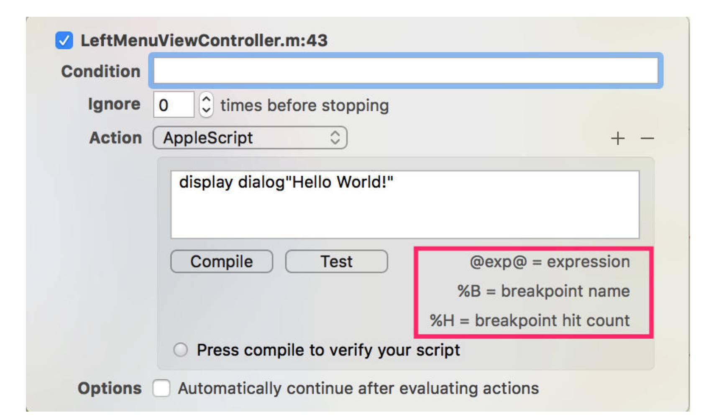

2-4

大家可能看到了，我在输入框中输入了本门至高无上的心法秘诀，它的意思是弹出一个显示“Hello World！”的对话框。点击Compile按钮后，如果没有错误，会显示成功信息。而点击Test按钮，会测试运行效果，如图2-5所示。


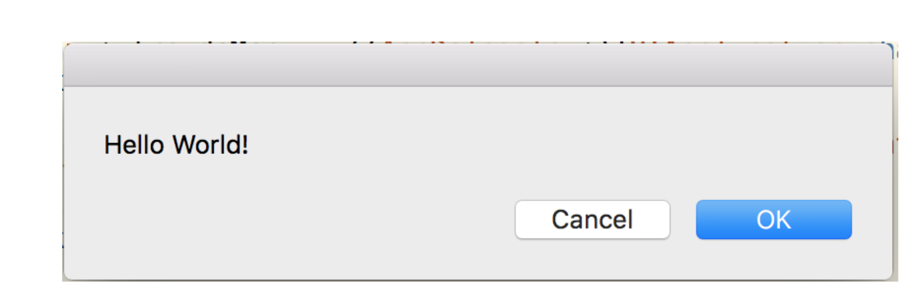

2-5

至于红色方框中的内容是三种特殊符号相对应的定义。

> | 符号标记 | 定义 |
> |:----: |:------:|
> |@expression@|LLDB表达式|
> |%B|断点的名称|
> |%H|遇到该断点的次数|

**2.Capture GPU Frame**
这个功能用于当断点生效时，捕获GPU当前所绘制的帧。该功能是辅助图形调试的。

**3.Debugger Command**
默认的选项，可以让断点执行LLDB调试命令。

**4.Log Message**
使用Log命令可以生成消息队列，将相关的消息输出到控制台上，还有一个Speak Message选项，可以播报消息。

**5.Shell Command**
该动作接收一个命令文件和参数列表。如下图2-6所示


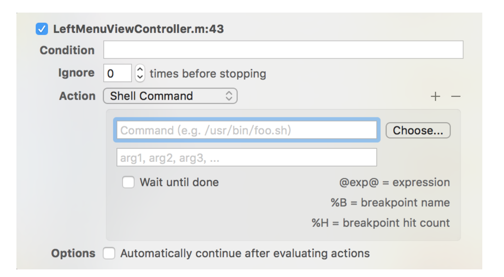

2-6

命令文件必须是一个可执行的二进制程序或者脚本。可以复制粘贴输入路径，也可以点击Choose按钮选择具体文件。

参数通过空格表示分割，也可以在两个@字符之间包含LLDB表达式。

一般情况下，Xcode会异步执行Shell Command，也就是说，Shell Command 和调试器将会同步执行。如果希望调试器在Shell Command命令完成后运行，则可以勾选下面的Wait until done选项。


**6.Sound**
动作会在断点被触发时，弹出声音提示。


### 第二部分 断点类型

---

#### 1.异常断点

异常断点是代码出现问题导致编译器抛出异常时触发的断点。它在断点导航器中设置。点击＋号，选择Exception Breakpoint选项。如下图3-1所示


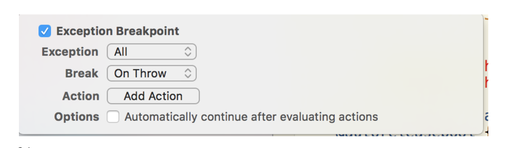

3-1

Exception

选项可以让你选择响应Objective－C对象抛出的异常，也可以选择响应C++对象抛出的异常。


**Break**则是选择断点所接收的异常，是接收“Throw”语句抛出的异常还是Catch语句的。

由于有一些异常的出现，是在不满足某些特定条件下而导致的，比如说在复杂循环中数组越界，这个时候往往不容易根据异常信息确定错误的出处，这个时候设置异常断点便能发挥作用。

#### 2.符号断点

他可以中断某个方法的调用，可谓是异常强大，在断点导航器界面，点击＋号，选择Add Symbolic Breakpoint选项，然后会弹出如图3-2所示的对话框。


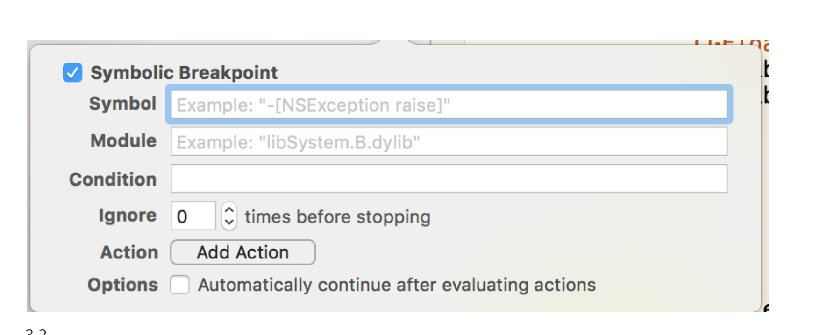

3-2

大家可以看到它比普通断点的自定义设置界面多出了两个内容，其一是**Symbol**，他用来设置当前断点作用域所能识别的方法，这里面既可以是自定义的方法，也可以是系统的API方法。（注意必须表明是类方法还是成员方法）

另一个**Module**是模组的意思，用来限制满足符号的方法，编译器将只会在断点满足这个模组的符号的时候才回暂停。

#### 3.OpenGL ES错误断点(OpenGl ES Error Breakpoint)

这个断点的作用和异常断点类似，只不过这个断点只有在openGL ES错误发生的时候才会触发。

#### 4.测试失败断点

仅在测试断点失败的时候才会执行，这个时候，应用将会暂停在引发测试失败的代码处，而不是停止在测试代码处。

作者：小唐羽锋

链接：https://www.jianshu.com/p/4b1cde902f2d

来源：简书

简书著作权归作者所有，任何形式的转载都请联系作者获得授权并注明出处。


# 基础篇

### 1.print命令

p 输出基本类型，例如double，int  po 输出对象类型，例如NSObject  当然po也是可以输出基本类型的  p命令默认是按10进制输出的，如果想输出非十进制可以用以下方法

二进制

```javascript
(lldb) p/t 10
(int) $2 = 0b00000000000000000000000000001010
```

八进制

```javascript
(lldb) p/o 10
(int) $3 = 012
```

十六进制

```javascript
(lldb) p/x 10
(int) $4 = 0x0000000a
```

更加详细的格式控制可以点击[这里](http://melonteam.com/https:/sourceware.org/gdb/onlinedocs/gdb/Output-Formats.html)查看

### 2.expression命令

顾名思义这个是命令可以在控制台执行一条语句  比如  expr i = 5，把5赋值给i  还有一种方式 po i = 5，也是有一样的效果的，都是让i的值变成5

### 3.设置断点

给某个类的某个OC方法下断点  br set -n “方法描述”

```javascript
(lldb) br set -n "[NSString stringWithFormat:]"
Breakpoint 2: where = Foundation`+[NSString stringWithFormat:], address = 0x000000010e292832
```

给所有类的某一SELECTOR下断点  br set -S **selector**

```javascript
(lldb) br set -S initWithFrame:
Breakpoint 4: 260 locations.
```

断点列表查看  br list

```javascript
(lldb) br list
Current breakpoints:
5: name = 'initWithFrame:', locations = 260, resolved = 260, hit count = 0
  5.1: where = UIKit`-[_UIPickerViewTopFrame initWithFrame:], address = x000000010ec60584, resolved, hit count = 0 
  5.2: where = UIKit`-[_UIOnePartImageView initWithFrame:], address = x000000010ec60a53, resolved, hit count = 0 
  5.3: where = UIKit`-[_UIPickerViewSelectionBar initWithFrame:], address = x000000010ec60c6c, resolved, hit count = 0 
  5.4: where = UIKit`-[_UIPickerWheelView initWithFrame:], address = x000000010ec60e3a, resolved, hit count = 0 
  5.5: where = UIKit`-[UIPickerView initWithFrame:], address = x000000010ec61bdf, resolved, hit count = 0 
  5.6: where = UIKit`-[_UIParallaxDimmingView initWithFrame:], address = x000000010ec70137, resolved, hit count = 0
```

删除全部断点  br del

```javascript
(lldb) br del
About to delete all breakpoints, do you want to do that?: [Y/n] Y
All breakpoints removed. (4 breakpoints)
```

删除某个断点  br del 断点index（断点list里前面的x.x，例如6.1）

```javascript
(lldb) br delete 6.1
0 breakpoints deleted; 1 breakpoint locations disabled.
```

也可以按组删除，直接输入组号就可以

```javascript
(lldb) br delete 6
1 breakpoints deleted; 0 breakpoint locations disabled.
```

### 4.设置观察点

我们有时候想知道某个变量是否发生改变了，可以通过设置观察点的方式监控

```javascript
(lldb) watchpoint set var self->_testA
Watchpoint created: Watchpoint 1: addr = 0x7fda62504708 size = 4 state = enabled type = w
    watchpoint spec = 'self->_testA'
    new value: 0
```

这样当有变化的时候便会断下来，控制台会输出如下

```javascript
Watchpoint 1 hit:
old value: 0
new value: 5
```

默认的命令只监测write，如果读也想监测的话可以这样

```javascript
(lldb) watchpoint set var -w read_write self->_testA
Watchpoint created: Watchpoint 1: addr = 0x7fc181c04238 size = 4 state = enabled type = rw
    watchpoint spec = 'self->_testA'
    new value: 0
```

当然也可以管理watchpoint  watchpoint list //列出所有的watchpoint  watchpoint del //删除所有的watchpoint

### 5.打印当前显示的ViewController

po [[[UIApplication sharedApplication] keyWindow] recursiveDescription]

### 6.打印当前屏幕上的View

po [[[[UIApplication sharedApplication] keyWindow] rootViewController] _printHierarchy]

### 7.沙盒路径

po NSHomeDirectory()

### 8.某些时候无法print frame

p (CGRect)[self.view frame]

### 9.Thread命令

有时候我们想让某个函数在调试的时候直接返回YES  可以断点到函数开头，然后执行以下语句  thread return YES

# 提高篇

### 1.image命令使用

平常我们出现crash的时候总会有如下输出

```javascript
2017-06-24 18:21:49.053 test[2419:11812168] *** Terminating app due to uncaught exception 'NSInvalidArgumentException', reason: '-[NSObject xxx:]: unrecognized selector sent to instance 0x61000000c130'
*** First throw call stack:
(
    0   CoreFoundation                      0x000000010c870b0b __exceptionPreprocess + 171
    1   libobjc.A.dylib                     0x000000010a40b141 objc_exception_throw + 48
    2   CoreFoundation                      0x000000010c8e0134 -[NSObject(NSObject) doesNotRecognizeSelector:] + 132
    3   CoreFoundation                      0x000000010c7f7840 ___forwarding___ + 1024
    4   CoreFoundation                      0x000000010c7f73b8 _CF_forwarding_prep_0 + 120
    5   test                                0x0000000109e3d74c -[ViewController viewDidLoad] + 108
    6   UIKit                               0x000000010aa8001a -[UIViewController loadViewIfRequired] + 1235
    7   UIKit                               0x000000010aa8045a -[UIViewController view] + 27
    8   UIKit                               0x000000010a94898a -[UIWindow addRootViewControllerViewIfPossible] + 65
    9   UIKit                               0x000000010a949070 -[UIWindow _setHidden:forced:] + 294
    10  UIKit                               0x000000010a95bebe -[UIWindow makeKeyAndVisible] + 42
    11  UIKit                               0x000000010a8d537f -[UIApplication _callInitializationDelegatesForMainScene:transitionContext:] + 4346
    12  UIKit                               0x000000010a8db5e4 -[UIApplication _runWithMainScene:transitionContext:completion:] + 1709
    13  UIKit                               0x000000010a8d87f3 -[UIApplication workspaceDidEndTransaction:] + 182
    14  FrontBoardServices                  0x000000010df805f6 __FBSSERIALQUEUE_IS_CALLING_OUT_TO_A_BLOCK__ + 24
    15  FrontBoardServices                  0x000000010df8046d -[FBSSerialQueue _performNext] + 186
    16  FrontBoardServices                  0x000000010df807f6 -[FBSSerialQueue _performNextFromRunLoopSource] + 45
    17  CoreFoundation                      0x000000010c816c01 __CFRUNLOOP_IS_CALLING_OUT_TO_A_SOURCE0_PERFORM_FUNCTION__ + 17
    18  CoreFoundation                      0x000000010c7fc0cf __CFRunLoopDoSources0 + 527
    19  CoreFoundation                      0x000000010c7fb5ff __CFRunLoopRun + 911
    20  CoreFoundation                      0x000000010c7fb016 CFRunLoopRunSpecific + 406
    21  UIKit                               0x000000010a8d708f -[UIApplication _run] + 468
    22  UIKit                               0x000000010a8dd134 UIApplicationMain + 159
    23  test                                0x0000000109e3da7f main + 111
    24  libdyld.dylib                       0x000000010d81065d start + 1
    25  ???                                 0x0000000000000001 0x0 + 1
)
libc++abi.dylib: terminating with uncaught exception of type NSException
```

我们可能一眼看不出是-[ViewController viewDidLoad]的第几行Crash了，这个时候我们可以使用image lookup命令

```javascript
(lldb) image lookup -a 0x0000000109e3d74c
      Address: test[0x000000010000174c] (test.__TEXT.__text + 108)
      Summary: test`-[ViewController viewDidLoad] + 108 at ViewController.m:22
```

这样子就很容易看出是第22行Crash了

### 2.野指针调试

一般野指针调试大家可能都是用Zombie Objects，但AutoreleasePool里面的crash用Zombie可能看不出来问题  这里我们介绍另外一种野指针调试方法Malloc History  Malloc History可以输出某一地址的malloc和free记录，从中我们可以得到一些有用信息帮助我们定位问题，比如MRC下赋值的时候没有retain导致用的时候野指针了。

首先要打开Malloc Stack选项  

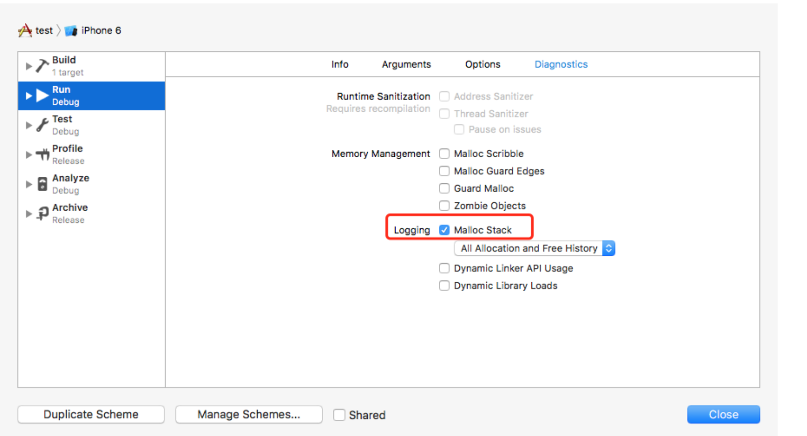

然后我们写个简单的程序

```javascript
- (void)viewDidLoad {
    [super viewDidLoad];
    NSDate *date = [[NSDate new] autorelease];
    [date release];
}
```

执行一下  

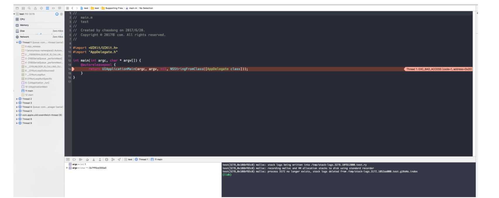

  如我们所料Crash了，但看堆栈和错误log好像没什么线索

我们查看左边Crash栈的第0帧

```javascript
#0    0x00000001034abd5b in objc_release ()
```

在控制台输入  p/x $rdi（$rdi在x64模拟器上是第一个寄存器，也就是指向OC方法中的Self）

```javascript
(lldb) p/x $rdi
(unsigned long) $1 = 0x0000600000005750
```

现在我们拿到Self指针了，然后就可以用Malloc History来追查了

在控制台中输入  command script import lldb.macosx.heap，开启相关命令

```javascript
(lldb) command script import lldb.macosx.heap
"malloc_info", "ptr_refs", "cstr_refs", "find_variable", and "objc_refs" commands have been installed, use the "--help" options on these commands for detailed help.
```

然后输入  malloc_info —stack-history xxxxxxx（xxxx是地址）  来查看相应地址的分配记录  这里我们输入malloc_info —stack-history 0x0000600000005750

```javascript
(lldb) malloc_info --stack-history 0x0000600000005750
0x0000600000005750: malloc(    16) -> 0x600000005750
stack[0]: addr = 0x600000005750, type=malloc, frames:
     [0] 0x0000000106a7844a libsystem_malloc.dylib`malloc + 24
     [1] 0x0000000103967ef2 CoreFoundation`-[__NSArrayM insertObject:atIndex:] + 242
     [2] 0x0000000102f823c3 Foundation`setProtocolMetadataWithSignature + 1051
     [3] 0x0000000102f82323 Foundation`setProtocolMetadataWithSignature + 891
     [4] 0x0000000102f81f47 Foundation`setProtocolMetdataWithMethods + 370
     [5] 0x0000000102f81d87 Foundation`setProtocolMetadata + 194
     [6] 0x0000000102f81cb8 Foundation`-[NSXPCInterface setProtocol:] + 87
     [7] 0x0000000102f81be7 Foundation`+[NSXPCInterface interfaceWithProtocol:] + 56
     [8] 0x000000010fc5dd56 libMobileGestaltExtensions.dylib`___lldb_unnamed_symbol104$$libMobileGestaltExtensions.dylib + 144
     [9] 0x000000010fc5df4f libMobileGestaltExtensions.dylib`___lldb_unnamed_symbol110$$libMobileGestaltExtensions.dylib + 34
     [10] 0x000000010fc5e41b libMobileGestaltExtensions.dylib`___lldb_unnamed_symbol125$$libMobileGestaltExtensions.dylib + 121
     [11] 0x000000010659ca9d libMobileGestalt.dylib`___lldb_unnamed_symbol61$$libMobileGestalt.dylib + 445
     [12] 0x00000001065a5847 libMobileGestalt.dylib`___lldb_unnamed_symbol688$$libMobileGestalt.dylib + 97
     [13] 0x000000010659ca16 libMobileGestalt.dylib`___lldb_unnamed_symbol61$$libMobileGestalt.dylib + 310
     [14] 0x000000010659fbd9 libMobileGestalt.dylib`___lldb_unnamed_symbol302$$libMobileGestalt.dylib + 66
     [15] 0x000000010659ca16 libMobileGestalt.dylib`___lldb_unnamed_symbol61$$libMobileGestalt.dylib + 310
     [16] 0x000000010709795f BaseBoard`__18-[BSPlatform init]_block_invoke + 29
     [17] 0x000000010685105c libdispatch.dylib`_dispatch_client_callout + 8
     [18] 0x00000001068369a1 libdispatch.dylib`dispatch_once_f + 503
     [19] 0x0000000107097940 BaseBoard`-[BSPlatform init] + 89
     [20] 0x00000001070978d9 BaseBoard`__28+[BSPlatform sharedInstance]_block_invoke + 41
     [21] 0x000000010685105c libdispatch.dylib`_dispatch_client_callout + 8
     [22] 0x00000001068369a1 libdispatch.dylib`dispatch_once_f + 503
     [23] 0x00000001070978ad BaseBoard`+[BSPlatform sharedInstance] + 41
     [24] 0x0000000103e665d1 UIKit`-[UIApplication _setClassicMode:] + 122
     [25] 0x0000000103e66bc5 UIKit`-[UIApplication _fetchInfoPlistFlags] + 328
     [26] 0x0000000103e4ad5a UIKit`-[UIApplication init] + 997
     [27] 0x0000000103e56f80 UIKit`UIApplicationInstantiateSingleton + 321
     [28] 0x0000000103e574af UIKit`_UIApplicationMainPreparations + 833
     [29] 0x0000000103e57104 UIKit`UIApplicationMain + 111
     [30] 0x0000000102ecaac3 test`main + 99 at main.m:14:9
     [31] 0x000000010689d65d libdyld.dylib`start + 1

......

stack[12]: addr = 0x600000005750, type=malloc, frames:
     [0] 0x0000000106a78485 libsystem_malloc.dylib`calloc + 30
     [1] 0x00000001034a2ba1 libobjc.A.dylib`class_createInstance + 85
     [2] 0x000000010397ddd1 CoreFoundation`__CFAllocateObject + 17
     [3] 0x000000010397dda2 CoreFoundation`+[__NSDate __new:] + 18
     [4] 0x0000000102eca8cc test`-[ViewController viewDidLoad] + 76 at ViewController.m:21:20
     [5] 0x0000000103ffa01a UIKit`-[UIViewController loadViewIfRequired] + 1235
     [6] 0x0000000103ffa45a UIKit`-[UIViewController view] + 27
     [7] 0x0000000103ec298a UIKit`-[UIWindow addRootViewControllerViewIfPossible] + 65
     [8] 0x0000000103ec3070 UIKit`-[UIWindow _setHidden:forced:] + 294
     [9] 0x0000000103ed5ebe UIKit`-[UIWindow makeKeyAndVisible] + 42
     [10] 0x0000000103e4f37f UIKit`-[UIApplication _callInitializationDelegatesForMainScene:transitionContext:] + 4346
     [11] 0x0000000103e555e4 UIKit`-[UIApplication _runWithMainScene:transitionContext:completion:] + 1709
     [12] 0x0000000103e527f3 UIKit`-[UIApplication workspaceDidEndTransaction:] + 182
     [13] 0x000000010700d5f6 FrontBoardServices`__FBSSERIALQUEUE_IS_CALLING_OUT_TO_A_BLOCK__ + 24
     [14] 0x000000010700d46d FrontBoardServices`-[FBSSerialQueue _performNext] + 186
     [15] 0x000000010700d7f6 FrontBoardServices`-[FBSSerialQueue _performNextFromRunLoopSource] + 45
     [16] 0x00000001039d9c01 CoreFoundation`__CFRUNLOOP_IS_CALLING_OUT_TO_A_SOURCE0_PERFORM_FUNCTION__ + 17
     [17] 0x00000001039bf0cf CoreFoundation`__CFRunLoopDoSources0 + 527
     [18] 0x00000001039be5ff CoreFoundation`__CFRunLoopRun + 911
     [19] 0x00000001039be016 CoreFoundation`CFRunLoopRunSpecific + 406
     [20] 0x0000000103e5108f UIKit`-[UIApplication _run] + 468
     [21] 0x0000000103e57134 UIKit`UIApplicationMain + 159
     [22] 0x0000000102ecaac3 test`main + 99 at main.m:14:9
     [23] 0x000000010689d65d libdyld.dylib`start + 1

stack[13]: addr = 0x600000005750, type=free, frames:
     [0] 0x00000001034a2d6e libobjc.A.dylib`object_dispose + 30
     [1] 0x000000010399c4a7 CoreFoundation`-[__NSDate dealloc] + 39
     [2] 0x00000001034acb8e libobjc.A.dylib`objc_object::sidetable_release(bool) + 202
     [3] 0x0000000102eca8f2 test`-[ViewController viewDidLoad] + 114 at ViewController.m:23:1
     [4] 0x0000000103ffa01a UIKit`-[UIViewController loadViewIfRequired] + 1235
     [5] 0x0000000103ffa45a UIKit`-[UIViewController view] + 27
     [6] 0x0000000103ec298a UIKit`-[UIWindow addRootViewControllerViewIfPossible] + 65
     [7] 0x0000000103ec3070 UIKit`-[UIWindow _setHidden:forced:] + 294
     [8] 0x0000000103ed5ebe UIKit`-[UIWindow makeKeyAndVisible] + 42
     [9] 0x0000000103e4f37f UIKit`-[UIApplication _callInitializationDelegatesForMainScene:transitionContext:] + 4346
     [10] 0x0000000103e555e4 UIKit`-[UIApplication _runWithMainScene:transitionContext:completion:] + 1709
     [11] 0x0000000103e527f3 UIKit`-[UIApplication workspaceDidEndTransaction:] + 182
     [12] 0x000000010700d5f6 FrontBoardServices`__FBSSERIALQUEUE_IS_CALLING_OUT_TO_A_BLOCK__ + 24
     [13] 0x000000010700d46d FrontBoardServices`-[FBSSerialQueue _performNext] + 186
     [14] 0x000000010700d7f6 FrontBoardServices`-[FBSSerialQueue _performNextFromRunLoopSource] + 45
     [15] 0x00000001039d9c01 CoreFoundation`__CFRUNLOOP_IS_CALLING_OUT_TO_A_SOURCE0_PERFORM_FUNCTION__ + 17
     [16] 0x00000001039bf0cf CoreFoundation`__CFRunLoopDoSources0 + 527
     [17] 0x00000001039be5ff CoreFoundation`__CFRunLoopRun + 911
     [18] 0x00000001039be016 CoreFoundation`CFRunLoopRunSpecific + 406
     [19] 0x0000000103e5108f UIKit`-[UIApplication _run] + 468
     [20] 0x0000000103e57134 UIKit`UIApplicationMain + 159
     [21] 0x0000000102ecaac3 test`main + 99 at main.m:14:9
     [22] 0x000000010689d65d libdyld.dylib`start + 1

stack[14]: addr = 0x600000005750, type=malloc, frames:
     [0] 0x0000000106a7844a libsystem_malloc.dylib`malloc + 24
     [1] 0x0000000103961f45 CoreFoundation`__CFDataInit + 613
     [2] 0x0000000102fba6c9 Foundation`-[NSISObjectiveLinearExpression init] + 154
     [3] 0x0000000102fba2f0 Foundation`-[NSISEngine init] + 419
     [4] 0x000000010481a8db UIKit`-[UIView(AdditionalLayoutSupport) _initializeHostedLayoutEngine] + 359
     [5] 0x000000010480d499 UIKit`-[UIView(UIConstraintBasedLayout) _layoutEngine_windowDidChange] + 130
     [6] 0x0000000103f13909 UIKit`-[UIView(Internal) _didMoveFromWindow:toWindow:] + 209
     [7] 0x0000000103f06b96 UIKit`__45-[UIView(Hierarchy) _postMovedFromSuperview:]_block_invoke + 151
     [8] 0x0000000103f06a7d UIKit`-[UIView(Hierarchy) _postMovedFromSuperview:] + 828
     [9] 0x0000000103f16a0a UIKit`-[UIView(Internal) _addSubview:positioned:relativeTo:] + 1927
     [10] 0x0000000103f04cf8 UIKit`-[UIView(Hierarchy) addSubview:] + 838
     [11] 0x0000000103ec2c6f UIKit`-[UIWindow addRootViewControllerViewIfPossible] + 806
     [12] 0x0000000103ec3070 UIKit`-[UIWindow _setHidden:forced:] + 294
     [13] 0x0000000103ed5ebe UIKit`-[UIWindow makeKeyAndVisible] + 42
     [14] 0x0000000103e4f37f UIKit`-[UIApplication _callInitializationDelegatesForMainScene:transitionContext:] + 4346
     [15] 0x0000000103e555e4 UIKit`-[UIApplication _runWithMainScene:transitionContext:completion:] + 1709
     [16] 0x0000000103e527f3 UIKit`-[UIApplication workspaceDidEndTransaction:] + 182
     [17] 0x000000010700d5f6 FrontBoardServices`__FBSSERIALQUEUE_IS_CALLING_OUT_TO_A_BLOCK__ + 24
     [18] 0x000000010700d46d FrontBoardServices`-[FBSSerialQueue _performNext] + 186
     [19] 0x000000010700d7f6 FrontBoardServices`-[FBSSerialQueue _performNextFromRunLoopSource] + 45
     [20] 0x00000001039d9c01 CoreFoundation`__CFRUNLOOP_IS_CALLING_OUT_TO_A_SOURCE0_PERFORM_FUNCTION__ + 17
     [21] 0x00000001039bf0cf CoreFoundation`__CFRunLoopDoSources0 + 527
     [22] 0x00000001039be5ff CoreFoundation`__CFRunLoopRun + 911
     [23] 0x00000001039be016 CoreFoundation`CFRunLoopRunSpecific + 406
     [24] 0x0000000103e5108f UIKit`-[UIApplication _run] + 468
     [25] 0x0000000103e57134 UIKit`UIApplicationMain + 159
     [26] 0x0000000102ecaac3 test`main + 99 at main.m:14:9
     [27] 0x000000010689d65d libdyld.dylib`start + 1
```

我们会发现这个地址的分配记录很多，但我主要关心我们自己程序的

```javascript
stack[12]: addr = 0x600000005750, type=malloc, frames:
     [0] 0x0000000106a78485 libsystem_malloc.dylib`calloc + 30
     [1] 0x00000001034a2ba1 libobjc.A.dylib`class_createInstance + 85
     [2] 0x000000010397ddd1 CoreFoundation`__CFAllocateObject + 17
     [3] 0x000000010397dda2 CoreFoundation`+[__NSDate __new:] + 18
     [4] 0x0000000102eca8cc test`-[ViewController viewDidLoad] + 76 at ViewController.m:21:20
     [5] 0x0000000103ffa01a UIKit`-[UIViewController loadViewIfRequired] + 1235
     [6] 0x0000000103ffa45a UIKit`-[UIViewController view] + 27
     [7] 0x0000000103ec298a UIKit`-[UIWindow addRootViewControllerViewIfPossible] + 65
     [8] 0x0000000103ec3070 UIKit`-[UIWindow _setHidden:forced:] + 294
     [9] 0x0000000103ed5ebe UIKit`-[UIWindow makeKeyAndVisible] + 42
     [10] 0x0000000103e4f37f UIKit`-[UIApplication _callInitializationDelegatesForMainScene:transitionContext:] + 4346
     [11] 0x0000000103e555e4 UIKit`-[UIApplication _runWithMainScene:transitionContext:completion:] + 1709
     [12] 0x0000000103e527f3 UIKit`-[UIApplication workspaceDidEndTransaction:] + 182
     [13] 0x000000010700d5f6 FrontBoardServices`__FBSSERIALQUEUE_IS_CALLING_OUT_TO_A_BLOCK__ + 24
     [14] 0x000000010700d46d FrontBoardServices`-[FBSSerialQueue _performNext] + 186
     [15] 0x000000010700d7f6 FrontBoardServices`-[FBSSerialQueue _performNextFromRunLoopSource] + 45
     [16] 0x00000001039d9c01 CoreFoundation`__CFRUNLOOP_IS_CALLING_OUT_TO_A_SOURCE0_PERFORM_FUNCTION__ + 17
     [17] 0x00000001039bf0cf CoreFoundation`__CFRunLoopDoSources0 + 527
     [18] 0x00000001039be5ff CoreFoundation`__CFRunLoopRun + 911
     [19] 0x00000001039be016 CoreFoundation`CFRunLoopRunSpecific + 406
     [20] 0x0000000103e5108f UIKit`-[UIApplication _run] + 468
     [21] 0x0000000103e57134 UIKit`UIApplicationMain + 159
     [22] 0x0000000102ecaac3 test`main + 99 at main.m:14:9
     [23] 0x000000010689d65d libdyld.dylib`start + 1
```

看[4]可以发现在-[ViewController viewDidLoad]的第21行malloc了一个对象

```javascript
stack[13]: addr = 0x600000005750, type=free, frames:
     [0] 0x00000001034a2d6e libobjc.A.dylib`object_dispose + 30
     [1] 0x000000010399c4a7 CoreFoundation`-[__NSDate dealloc] + 39
     [2] 0x00000001034acb8e libobjc.A.dylib`objc_object::sidetable_release(bool) + 202
     [3] 0x0000000102eca8f2 test`-[ViewController viewDidLoad] + 114 at ViewController.m:23:1
     [4] 0x0000000103ffa01a UIKit`-[UIViewController loadViewIfRequired] + 1235
     [5] 0x0000000103ffa45a UIKit`-[UIViewController view] + 27
     [6] 0x0000000103ec298a UIKit`-[UIWindow addRootViewControllerViewIfPossible] + 65
     [7] 0x0000000103ec3070 UIKit`-[UIWindow _setHidden:forced:] + 294
     [8] 0x0000000103ed5ebe UIKit`-[UIWindow makeKeyAndVisible] + 42
     [9] 0x0000000103e4f37f UIKit`-[UIApplication _callInitializationDelegatesForMainScene:transitionContext:] + 4346
     [10] 0x0000000103e555e4 UIKit`-[UIApplication _runWithMainScene:transitionContext:completion:] + 1709
     [11] 0x0000000103e527f3 UIKit`-[UIApplication workspaceDidEndTransaction:] + 182
     [12] 0x000000010700d5f6 FrontBoardServices`__FBSSERIALQUEUE_IS_CALLING_OUT_TO_A_BLOCK__ + 24
     [13] 0x000000010700d46d FrontBoardServices`-[FBSSerialQueue _performNext] + 186
     [14] 0x000000010700d7f6 FrontBoardServices`-[FBSSerialQueue _performNextFromRunLoopSource] + 45
     [15] 0x00000001039d9c01 CoreFoundation`__CFRUNLOOP_IS_CALLING_OUT_TO_A_SOURCE0_PERFORM_FUNCTION__ + 17
     [16] 0x00000001039bf0cf CoreFoundation`__CFRunLoopDoSources0 + 527
     [17] 0x00000001039be5ff CoreFoundation`__CFRunLoopRun + 911
     [18] 0x00000001039be016 CoreFoundation`CFRunLoopRunSpecific + 406
     [19] 0x0000000103e5108f UIKit`-[UIApplication _run] + 468
     [20] 0x0000000103e57134 UIKit`UIApplicationMain + 159
     [21] 0x0000000102ecaac3 test`main + 99 at main.m:14:9
     [22] 0x000000010689d65d libdyld.dylib`start + 1
```

看[3]发现我们在-[ViewController viewDidLoad]的第23行free了

我们看看对应代码  

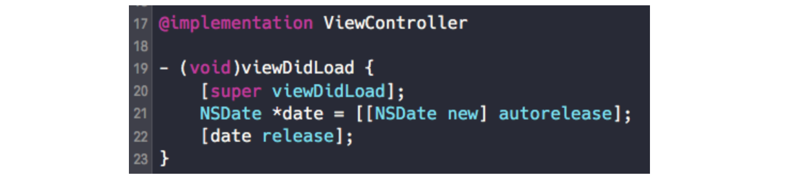

  可以明显看出是21行加了一个autorelease，22行又release了导致出问题的

当然这是个简单的demo，实际情况会复杂的多，使用Malloc History也只是能提供更多信息来追查相应问题，不能保证一定能找出导致野指针的地方。

# 汇编篇

### 1.寄存器

在我们在调试的时候有时候查看寄存器会有很多有用的信息，我们先介绍下函数调用约定  x64模拟器：

- %rax 作为函数返回值使用。
- %rsp 栈指针寄存器，指向栈顶
- %rdi，%rsi，%rdx，%rcx，%r8，%r9 用作函数参数，依次对应第1参数，第2参数。。。
- %rbx，%rbp，%r12，%r13，%14，%15 用作数据存储，遵循被调用者使用规则，简单说就是随便用，调用子函数之前要备份它，以防他被修改
- %r10，%r11 用作数据存储，遵循调用者使用规则，简单说就是使用之前要先保存原值

ARM64：  arm64有32个64bit长度的通用寄存器x0～x30还有一个SP寄存器，因为arm64兼容32位所以可以只使用其中的低32bit别名w0～w30

- r0-r7：参数/结果寄存器，r0存储返回值
- r8：Indirect result location寄存器(直接结果位置寄存器;)
- r9-r15：临时寄存器，存储函数的局部变量。
- r16：IP0 第1个intra-procedure-call scratch寄存器(第1个内部过程调用寄存器或临时寄存器IP0;)
- r17：IP1 第2个intra-procedure-call 临时寄存器 (可能被调用者 和 PLT代码是用）;
- r18：平台寄存器（如果需要的话）;否则，就是一个临时寄存器
- r19-r28：由被调用者 保存的寄存器
- r29：FP栈帧指针
- r30：LR链接寄存器
- SP：栈寄存器

我们常用的一般都是传递前几个参数的寄存器，在OC方法里，一般第一个参数是Self，第二个参数是Selector，所以我们最常见的寄存器是rdi，rsi，x0，x1。  上面我们在查找野指针的时候po $rdi，也就是查看第一个寄存器也就是Self的值。

### 2.X命令

X命令是直接输出内存内容，非常好使

命令格式  x/nfu

参数解释：  n，表示要显示的内存单元的个数  f，表示显示方式, 可取如下值：

| 参数 | 含义                       |
| ---- | -------------------------- |
| x    | 按十六进制格式显示变量     |
| d    | 按十进制格式显示变量       |
| u    | 按十进制格式显示无符号整型 |
| o    | 按八进制格式显示变量       |
| t    | 按二进制格式显示变量       |
| a    | 按十六进制格式显示变量     |
| i    | 指令地址格式               |
| c    | 按字符格式显示变量         |
| f    | 按浮点数格式显示变量       |

u，表示一个地址单元的长度：

| 参数 | 含义             |
| ---- | ---------------- |
| b    | 按单字节分段输出 |
| h    | 按双字节分段输出 |
| w    | 按四字节分段输出 |
| g    | 按八字节分段输出 |

，表示内存地址，可以是变量名，也可以是内存地址。  更加详细的说明可以看[这里](http://visualgdb.com/gdbreference/commands/x)

一些常用的组合：  x/16xb self  会显示 self 指针地址内容，16 个字节，16 进制。  x/16cb charArray  会显示地址 charArray 地址的内容，16 个字节，按字符格式显示。

比如我们定义  char *charArray = “0123456789ABCDEF”;  分别试下两种输出

```javascript
(lldb) x/16xb charArray
0x10b16155a: 0x30 0x31 0x32 0x33 0x34 0x35 0x36 0x37
0x10b161562: 0x38 0x39 0x41 0x42 0x43 0x44 0x45 0x46
(lldb) x/16cb charArray
0x10b16155a: 0123456789ABCDEF
```

可以看出第一种输出的是Ascii码，第二种直接输出字符了。输出查看的时候有一点要注意，arm是小端存储，低地址存放的是低位~

PS：有时候Crash的时候输出下x/16a $rsp，会看到一些额外信息~