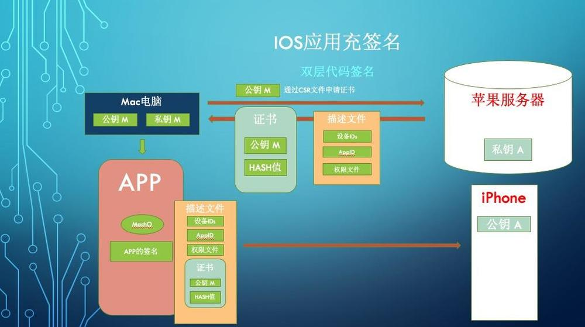

# 10.2 iOS逆向-APP重签名



##### 1、向服务器申请证书

- 什么是CSR文件
  申请过开发者证书的都知道，要申请证书，都有「Mac本地通过CSR文件向服务器」这样的一步。那么这一步到底做了写什么呢？
  先看看什么是CSR

> CSR是Certificate Signing Request的英文缩写，即证书请求文件，也就是证书申请者在申请数字证书时由CSP(加密服务提供者)在生成私钥的同时也生成证书请求文件，证书申请者只要把CSR文件提交给证书颁发机构后，证书颁发机构使用其根证书私钥签名就生成了证书公钥文件，也就是颁发给用户的证书。

通俗一点，就是Mac本地有一对公钥(公钥M)和私钥(私钥M)([什么是公钥私钥？](https://www.jianshu.com/p/4a920586a01f))，在Mac上对公钥M进行了一层包装，这包装后的新东西就是CSR。

- 服务器通过CSR返回证书
  本地有了CSR文件之后，将CSR上传到Apple的服务器。
  Apple服务器其实也是有一对公钥(公钥A)和私钥(私钥A),在收到Mac上传过来的的CSR文件之后，取出其中的公钥M，用Apple服务器的私钥A对公钥M进行一次数字签名（[什么是数字签名？](https://www.jianshu.com/p/0ae3cff949e5)）得到开发证书，然后将开发证书附入描述文件（描述文件还有哪些东西下文会有讲到），最后将描述文件传回给我们的Mac电脑。

##### 2、描述文件

> 配置描述文件是 XML 文件，包含以下内容：设备的安全策略和限制、VPN 配置信息、无线局域网设置、电子邮件帐户和日历帐户以及可允许 iPhone、iPod touch 和 iPad 配合您的企业系统使用的鉴定凭证。配置描述文件能快速地将设置和授权信息载入到设备上。有些 VPN 和无线局域网设置只能使用配置描述文件来设定，而且如果您使用的不是 Microsoft Exchange，则将需要使用配置描述文件来设定设备密码策略。

描述文件包括的东西，如：

- 开发证书
- APP的Bundle Id
- 证书所信任的Device Id
- 还有一些权限文件（如：Apple Pay，通知，VPN，iCloud）

##### 3、Mac打包APP

在Mac本地有了描述文件之后，就可以对APP进行打包了，打包这个过程除了对APP的压缩之外，更重要的其实是指对APP的加密。
之前本地把公钥M发送给Apple服务器，本地剩下的私钥M就是用来加密APP的，得到一个APP的签名文件，再将上一步得到的描述文件，以及MachO文件一起打包压缩，最终就得到了我们的ipa包了。
所以ipa其实包含以下三种东西

- MachO文件
- APP的签名文件
- 描述文件

##### 4、iPhone验证ipa文件

上文提到的私钥A是用来加密了公钥M，与之对应的公钥A其实在我们激活iPhone的同时已经下载好了，一直躺在我们的iPhone里面。
有了公钥M，那么一切就简单了，

- 公钥A解开ipa中携带的描述文件中的证书得到公钥M
- 对公钥M进行Hash，对比证书中的Hash
- 对比通过之后，用公钥M对加密的APP进行解密，得到最终APP。

## 3、手动对APP进行重签名 （如果不想看具体过程，可以跳到本节末尾，有流程总结）

从上面可以得知，双层签名其实本质就是如下三个步骤：

- APP的Bundle id的验证
- 描述文件本身的验证
- 对APP签名的验证

*注：对APP进行重新签名，前提是这个APP已经被砸壳了。*
下载已经砸壳成功的APP，以下例子用微信举例：[越狱版本微信7.0.2](https://pan.baidu.com/s/16MPzurhu15rWlq3Gjs1bxg)提取码: 2w87

具体步骤：

#### Step 1 进入WeChat目录

解压出 Wechat7.0.2越狱 ，进入WeChat目录

```
// 进入WeChat的目录
cd /Users/dengbin/Desktop/分享/主目录/资料/Wechat7.0.2越狱/Payload
```

#### Step 2 查看APP的证书情况

```
codesign -d -vv「WeChat.app路径」
```


查看APP证书情况.png

#### Step 3 查看验证APP是否被加密

进入APP的包内容可以看到其中有一个WeChat的可执行文件，也就是是MachO文件，就是要查看这个MachO文件时候被加密


WeChat目录.png


WeChat_MachO.png

```
otool -l WeChat | grep cryp
```

其中`cryptid`为`0`代表已经砸壳，即解密，为`1`或者`2`表示以`第1类`或者`第2类`加密方案加密。

> 有些老铁回复说复制代码运行后会报错，有两种情况：
> 1、电脑里没有Xcode-select，应该先去装一次，很简单，自行百度。
> 2、如果还不行，代码不要复制，自己敲一遍，就可以。（为何有些人复制不行就不得而知了）。

#### Step 4 查看本地证书并记录需要用到的证书

```
security find-identity -v -p codesigning
```


本地证书列表.png

#### Step 5 删除不可签名的插件(还有Watch中的插件)

由于本地存在一些插件，这些插件是不可被我们重签，并且这个过程我们用不着，所以我们索性就删掉。
其中包括：整个目录PlugIns目录和整个Watch目录(因为Watch.app中也有个PlugIns)


PlugIns.png


Watch.png

#### Step 6 Framework重签名

这一步就是比较繁琐的了，需要将Frameworks下的所有Framework进行重签名，运用到XCode提供的`codesign`指令，参数中的证书就是`Step 4`中的一个。具体使用哪个就看个人了

```
codesign –fs 「证书串」 「文件名」
```


Frameworks.png


Frameworks证书重签.png

#### Step 7 给MachO添加可执行权限

由于MachO本身就有可执行权限，所以这一步跳过。

#### Step 8 App重签名

- 新建一个WeChat同名工程（下文称NewWeChat，原来的微信APP称之为WeChat）

- Build NewWeChat工程，进入被编译出的WeChat.App目录，找到其中的embedded.mobileprovision文件，将其复制到WeChat.App（越狱微信）中


  

  Build后的WeChat.png


  

  embedded.mobileprovision文件.png


  

  复制后的结果.png

- 在WeChat.App找到info.plist，并修改其中的BundleId为NewWeChat的BundleId


  

  更改BundleId.png

- 查看embedded文件

```
security cms -D -i 「 embedded文件路径」
```

找到其中的entitlements字段，并且复制entitlements字段和其中的内容


查看embedded.png


entitlements字段.png

- 在NewWeChat中新建entitlements.plist文件，将上一步复制得到的「entitlements字段内容」拷贝入新的entitlements.plist文件,然后将entitlements.plist复制到WeChat.app的同级目录下。


  

  拷贝entitlements.png


  

  复制entitlements.png

- 对APP重新签名
  进入WeChat目录，对APP使用新的描述文件进行重签

```
codesign -fs 「证书串」 --no-strict --entitlements=entitlements.plist
```


对App进行重签.png

- 压缩Playload

```
 zip –ry 「输出文件名」 「输入文件名」
```


压缩Playload.png

#### Step 9 安装新的ipa

可以通过各种途径安装ipa，如Xcode，PP助手，fir，iTunes等等， 如果手机上有正版的微信，在安装完我们重签名的ipa包后会发现手机上就有两个微信啦！！！

如果想用LLDB调试微信，可以将重签后的WeChat.app替换NewWeChat Build后的WeChat.app，然后直接运行(Run)项目，就会发现我们可以用LLDB了。

#### Step 10 再次验证新的ipa是否真的重签成功

这一步其实是重复Step 3

```
codesign -d -vv「WeChat.app路径」
```

步骤总结：

```
1、cd WeChat // 进入WeChat的目录
2、codesign -d -vv「WeChat.app路径」 // 查看APP的证书情况
3、otool –l WeChat | grep cryp // 查看APP是否被加密
4、security find-identity -v -p codesigning // 查看本地证书
5、删除不可签名的插件(还有Watch中的插件)
6、codesign –fs 「证书串」 「文件名」 // Framework重签名
7、chmod +x 可执行文件   // 给文件添加权限
8、App重签名
     ① 新建一个项目并且命名为 WeChat（下文称NewWeChat，原来的微信APP称之为WeChat） -> Build -> 找到APP中的权限文件 embedded.mobileprovision
     ② 复制embedded.mobileprovision到WeChat.app中
     ③ 修改WeChat.app中info.plist的BundleId
     ④ security cms -D -i 「 embedded文件路径」 //查看WeChat中的embedded文件，复制WeChat中entitlements.plist文件的entitlements字段
     ⑤ 在NewWeChat中新建entitlements.plist文件，将上一步复制得到的「entitlements字段和其中的内容」拷贝入新的entitlements.plist文件
     ⑥ codesign -fs 「证书串」 --no-strict --entitlements=entitlements.plist //复制新的entitlements到WeChat.app的同级目录，并且对APP重新签名
     ⑦ zip –ry 「输出文件名」 「输入文件名」 // 压缩Playload
9、安装ipa 
10、再次验证新的ipa是否真的重签成功
```

- 注意：有些人会安装失败，或者安装成功会有Crash的问题，这是因为当前描述文件在我们的手机还不受信任，用新工程NewWeChat在手机上跑一遍，然后删除NewWeChat，在尝试安装新的ipa，问题可以解决。

